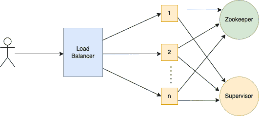
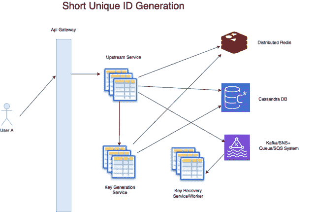

# 唯一 ID 生成系统设计

> 原文：[`techbyexample.com/unique-id-generation/`](https://techbyexample.com/unique-id-generation/)

目录

+   概述

+   唯一 ID 的类型

    +   唯一 ID（松散可排序）")

    +   唯一 ID（不可时间排序）或随机 UUID or Random UUID")

    +   序列号

+   唯一 ID（松散可排序）")

    +   UUID 或 GUID

    +   96 位 GUID

    +   64 位 ID

    +   Twitter 的 Snowflake

    +   Instagram ID 生成器

+   唯一 ID（不可时间排序）或随机 UUID or Random UUID")

    +   6 位、7 位或 8 位长度的 Base64 编码数字

    +   16 位或 32 位随机 ID

+   序列号

+   时间可排序唯一 ID 的高层设计

    +   API 详情

    +   时间组件

    +   高层设计

+   不可时间排序的唯一 ID（或随机 UUID）的高层设计 or Random UUID")

    +   数据库架构

    +   选择使用哪个数据库

    +   如何解决并发问题

    +   如果键范围耗尽会发生什么

    +   KGS 服务不是单点故障吗？

+   结论

# **概述**

分布式系统如今已成为常态。有时需要在这些分布式系统中生成唯一 ID。这些唯一 ID 的需求可能包括：

+   公司中有一个订单管理系统，每个订单都需要有一个唯一的 ID。

+   系统中存储的每个用户都需要有一个唯一 ID。

+   如果我们以 Instagram 为例，那么用户可能会有数十亿条状态更新或帖子。每个帖子都需要一个不同的唯一 ID。

+   ……

# **唯一 ID 的类型**

此外，在唯一 ID 生成器方面，有三种类型的 ID 可以生成

+   唯一 ID（松散可排序）

+   唯一 ID（非松散可排序）或随机唯一 ID

+   序列号

首先让我们看看这些定义，然后再详细了解每个唯一 ID

## **唯一 ID（松散可排序）**

这些 ID 是松散的时间可排序，并且可以以去中心化的方式生成。正如我们在本文中将看到的那样，有多种生成方法。这些 ID 通常包含时间组件，通常是纪元时间。

示例包括 UUID（128 位），MongoDB 对象 ID（96 位），64 位 ID。由于这些 ID 是时间可排序的，因此可以被应用程序用于组织数据。

UUID 示例（128 位）

```go
815b15597e8a4a4d4302d73e4682f4fc
442bc58166b6ab626ceed57f51982474
442bc58166b6ab626ceed57f51982474
```

## **唯一 ID（不可时间排序）或随机 UUID**

这些通常是短 ID，通常长度为 6、7 或 8 个字符。例如，有一个短字符串用于生成短网址。这些短网址可以被像 bitly.com 或 YouTube 这样的网站使用。YouTube 使用这些短网址来分享视频，方便分享。因此，这些 ID 本身并没有排序的用例。它们也可以是大的 ID，且与排序无关。

一个大随机 ID 的示例是，当某人在支付网关进行支付时，提供的参考 ID 或交易 ID。这些 ID 完全随机，避免了任何人能够猜测参考 ID 或交易 ID。

可能还会有更多类似的需求，我们需要生成数十亿条记录。

7 个字符 ID 的示例

```go
ETL2W7q
aTyUW89
bSZVK7I
```

## **序列号**

正如其名字所示，这是一个自动递增的数字。在分布式系统中生成序列号时，需要了解系统中其他工作者的信息。因此，它需要一个共享状态。由于需要集中管理，在分布式系统中高效地生成序列号是非常困难的。

一个序列号的示例是 MySQL 自动递增数字

示例

```go
1
2
3
.
.
.
n
```

我们首先来看一下描述和设计

+   唯一 ID（松散可排序）

+   接下来是唯一 ID（非松散可排序）或随机唯一 ID

+   最后，我们将讨论序列号生成

# **唯一 ID（松散可排序）**

一些唯一 ID 生成系统的需求可能是：

+   生成的唯一 ID 应当是短的

+   生成的 ID 应当是时间可排序的

+   应该能够以可用的方式每秒生成 10000 个 ID

我们系统中可能生成的一些唯一 ID 是：

+   UUID 或 GUID，长度为 128 位

+   96 位 UUID。例如 Mongo DB 对象 ID

+   64 位 UUID

+   56 位 UUID

## **UUID 或 GUID**

UUID 代表通用唯一标识符。它是一个 16 字节或 128 位的 ID，保证唯一。

**UUID 或 GUID 的优势**

+   不需要专门的独立系统来生成这些 ID

+   这些 ID 的生成速度很快

+   这些 ID 是按时间排序的。

**缺点**

+   GUID 或 UUID 的主要缺点是其大小。

+   可能会发生冲突，但几率非常小。

## **96 位 GUID**

Mongo DB 对象为 12 字节或 96 位。每个 ID 包含：

+   一个 4 字节的时间戳值，表示从纪元时间以来的秒数。

+   一个 5 字节的随机值。

+   一个 3 字节的增量计数器。

该对象 ID 在 Mongo DB 世界中对于每个分片都是唯一的。这意味着，由两个不同分片生成的两个不同对象 ID 可能是相同的。

**优点**

+   生成的 ID 是时间可排序的。

**缺点**

+   尺寸仍然较大，这可能导致索引变得庞大。

+   因此，这些 ID 不能在需要小于 64 位的 ID 的地方使用。

## **64 位 ID**

可以生成 64 位的 ID，这些 ID 是按时间排序的。而且由于它是 64 位，它的大小显然也较小。

对于 64 位 ID，我们有两种方法需要考虑。

## **Twitter 的 Snowflake**

Twitter 的 Snowflake 被创建用于生成 64 位唯一 ID。它使用三个标准来确定唯一 ID。

+   当前时间戳（毫秒级）——为 41 位，基于纪元系统，它给我们 69 年的时间。

+   生成唯一 ID 的实例的序列号——为 10 位，因此允许 2¹⁰ = 1024 个实例。

+   生成唯一 ID 的实例中的线程的序列号——为 12 位，允许每个实例 2¹² = 4096。

+   1 位保留供未来使用。

让我们看看这个系统的可扩展性。可以有 1024 个实例，因此没有单点故障。通过 1024 个实例，系统现在有更多节点来处理流量。

**缺点**

+   它需要 Zookeeper 来管理机器的映射。

+   需要多个 Snowflake 服务器，这增加了管理和复杂度。

## **Instagram ID 生成器**

它还生成一个 64 位 ID。每个 ID 包含：

+   41 位时间戳（毫秒级）。如果我们有自定义纪元，它可以提供 69 年的时间。

+   13 位代表逻辑分片 ID。

+   10 位表示每个分片的序列号。

基本上，每个分片每毫秒可以生成 1024 个 ID。

分片系统有成千上万的逻辑分片，这些分片映射到少数物理机器。由于它使用逻辑分片，因此我们可以从较少的物理服务器开始，这些服务器包含许多逻辑分片。一旦分片变大，我们可以添加更多物理服务器并将这些分片迁移到新物理服务器中。只需要将分片移到新的物理服务器，无需进行数据的重新分配。

Instagram ID 生成器不需要像 Twitter Snowflake 那样的 Zookeeper。它使用 Postgress 架构特性进行管理。

**什么是 Postgress 架构**

Postgress 数据库由多个模式（schema）组成，每个模式又包含多个表。表名必须在每个模式内唯一。所以在 Instagram 的例子中，每个逻辑分片会映射到一个模式，模式中的表用来生成 ID。

# **唯一 ID（不可按时间排序）或随机 UUID**

这种 ID 的示例。

+   6、7 或 8 位长度，分别为 36、42 和 48 位长度。

+   16 字符长度的 ID。

+   32 字符长度的 ID。

## **6 或 7 或 8 位的 base 64 编码数字**

由于它是 base 64 编码的，因此每个数字占 6 位。

+   所以如果唯一 ID 是 6 位，那么总长度将是 7*6=42 位。

+   所以如果唯一 ID 是 7 位，那么总长度将是 7*6=42 位。

+   如果唯一 ID 的大小是 8，那么总长度将是 8*6=48 位。

使用此类 ID 的一些用例是：

+   URL 短链接系统，其中要求 URL 尽可能短。

+   Paste Bin 类型的系统再次要求生成的 Paste Bin 需要短小。

+   Youtube 需要这样的 ID 来生成视频的短链接。

**优点**

+   大小非常小，因此适合共享。

**缺点**

+   这些生成的 ID 不是按时间排序的。

## **16 或 32 位随机 ID**

这种 ID 的字符范围可以超过 100 个 ASCII 字符。由于它使用了一个大的字符集，因此生成这些 ID 非常简单，碰撞的几率也较小。

16 位随机 ID 示例。

```go
PO2bc58166b6ab62
E#5B15597e8a$a4$
```

32 位随机 ID 示例。

```go
PO2bc58166b6ab626ceed57f5198247$
E#5B15597e8a$a4$YU02d73e4682f4FC
```

# **序列号**

这些 ID 可以通过使用一个数据库来生成，数据库可以为我们提供自动递增的数字。由于是数据库生成唯一 ID，因此可以保证 ID 的唯一性。

顺序生成的唯一 ID。例如，数据库生成唯一递增的 ID。

**优点**

+   可以生成短增量 ID。

+   它易于按时间排序。

**缺点**

+   生成的唯一 ID 可以是任意长度。

+   系统不可扩展，生成唯一 ID 的实例是单点故障。

为了提高可扩展性并防止单点故障，我们可以增加实例的数量。每个实例的递增方式会不同。

+   例如，如果我们有两个实例，那么一个实例会生成偶数，另一个实例会生成奇数。

+   如果我们有三个实例，第一个实例会生成 3 的倍数的 ID，第二个实例会生成 3 的倍数加 1 的 ID，第三个实例会生成 3 的倍数加 2 的 ID。

即使增加实例的数量，仍然有一些缺点。

+   它不再是一个序列号。

+   由两个不同实例生成的唯一 ID 不再按时间排序。例如，假设有两个实例，一个实例可能生成类似 1001 或 1003 的 ID，另一个实例可能会同时生成类似 502 或 506 的 ID。显然，仅通过查看两个 ID 很难判断哪个先生成。

+   如果流量非常大，我们必须增加更多的实例。类似地，假设流量较少，我们需要减少一些实例。增加和减少实例可能涉及更改每个实例的 ID 生成逻辑，管理这些事情既复杂又困难。

Flickr 唯一 ID 生成器采用了上述方法。

# **可排序的时间唯一 ID 高级设计**

系统的部分非功能性要求是它应该具有高度的可扩展性和可用性

## **API 详细信息**

我们的系统中只需要一个 API。这个 API 将用于获取一批生成的唯一 ID。因此，它基本上会返回一个唯一 ID 数组。

我们将生成一个包含以下字段的 ID

+   时间部分

+   机器编号

+   进程或线程编号

+   本地计数器

这是每个字段的描述

+   时间部分 – 它表示唯一 ID 的时间组件。将时间组件添加到唯一 ID 中，使其可以按时间排序。

+   机器编号 – 这是机器、实例或容器的唯一编号。

+   线程编号 – 分配给每个线程的唯一编号

+   本地计数器 – 这是线程在一毫秒内可以生成的唯一 ID 数量

我们将生成一个 64 位的 ID。通过 64 位 ID，我们可以生成 2⁶⁴ 个 ID。如果我们的需求是每秒 1 亿个 ID，

## **时间组件**

时间组件所占的 64 位数将取决于我们应用程序的生命周期。时间戳将是从 EPOCH 时间开始的毫秒数。还要注意，EPOCH 时间戳从 1970 年 1 月 1 日开始。但对于我们的应用程序，可以有一个自定义的纪元时间戳，开始时间是 2022 年 1 月 1 日或其他任何与应用程序开始相关的日期。

假设我们的应用程序生命周期是 50 年。我们的唯一 ID 将包含毫秒组件。因此，50 年的毫秒数为

50*365*24*60*60 = 1577000000000 毫秒

存储如此大数字所需的位数是 41 位。基本上，41 位是因为

```go
2⁴⁰ < 1577000000000 < 2⁴¹
```

实际上，这里有一个表格，告诉你时间戳的位数如何定义年份。

| **位数** | **最大二进制数** | **毫秒数** | **年份数** |
| --- | --- | --- | --- |
| 40 位 | 1111111111111111111111111111111111111111 | 1099511627979 | 34.8 年 |
| 41 位 | 11111111111111111111111111111111111111111 | 2199023255755 | 69.7 年 |
| 42 | 111111111111111111111111111111111111111111 | 4398046511307 | 139.4 年 |

让我们看看每个组件需要多少位。

+   时间组件 – 41 位

+   机器组件 – 10 位 – 最大 2¹⁰ = 1024 个实例或机器或容器

+   线程组件 – 3。每个实例或机器或容器最多 2³ 个线程。

+   本地计数器 – 10。每个容器每毫秒最多生成 2¹⁰ 个唯一 ID。

让我们检查一下我们服务的容量

+   最大实例数 – 2¹⁰ = **1024**

+   每个实例的线程数 – 2³ = **8**

+   最大线程数 – 2¹⁰*2³ = 2¹³ = **8192**

+   每个线程每毫秒生成的唯一 ID = 2¹⁰ = **1024**

+   每毫秒可能生成的唯一 ID 数量 = 2¹³*2¹⁰ = 2²³ = **8,388,608** = 每毫秒大约 800 万个

+   每秒可能生成的唯一 ID 数量 = 2²³*1000 = **8,388,608,000** = 每秒 80 亿个唯一 ID

所以理论上这个系统每秒可以生成 80 亿个唯一 ID，总时长为 69.7 年……我们也可以拥有一个生成 56 位 ID 的系统。让我们看看每个组件需要多少位

+   时间组件 – 41 位

+   机器组件 – 8 位 – 最大 2⁸ = 256 个实例、机器或容器

+   线程组件 – 2 位。每个实例、机器或容器最多可有 2² = 4 个线程

+   本地计数器 - 4 位。每毫秒每个容器最多可生成 2⁴ 个唯一 ID。

让我们检查一下服务的容量

+   最大实例数 – 2¹⁰ = **1024**

+   每个实例的线程数量 – 2² = **4**

+   最大线程数 – 2¹⁰*2² = 2¹² = **4096**

+   每个线程每毫秒生成的唯一 ID（本地计数器） = 2⁴ = **16**

+   每毫秒可能生成的唯一 ID 数量 = 2¹²*2⁴ = 2¹⁶ = **65,536** = 每毫秒大约 65K

+   每秒可能生成的唯一 ID 数量 = 2¹⁶*1000 = **65,536,000** = 每秒 6500 万个唯一 ID

所以理论上这个系统每秒可以生成 6500 万个唯一 ID，总时长为 69.7 年

**我们能选择一个非常长的时间戳，使得时间戳可以达到 10000 年或更长吗？**

选择一个非常长的时间戳将需要更多的位数，这将限制工作节点、线程或本地计数器的数量。这反过来又限制了每秒生成唯一 ID 的能力。

**我们如何为系统中的每个机器或实例分配一个唯一编号？**

我们可以在这里使用 ZooKeeper。每当一个新的实例、机器或容器启动时，它可以向 ZooKeeper 注册并从 ZooKeeper 获取一个唯一编号

## **高层设计**

+   将会有一个 ZooKeeper 服务

+   将会有一个负载均衡器，后面会有多个实例

+   每个实例启动时，它会向 ZooKeeper 注册。当它注册时，它会从 ZooKeeper 获得一个唯一的编号。这个唯一编号的范围从 1 到 1024，因为我们只有 10 位用于实例编号。

+   实例的自动扩展将基于 CPU 负载进行。每个集群中的节点都会向一个监控者发送其 CPU 状态。监控者将根据 CPU 负载来添加或移除集群中的实例或机器。如果我们使用 AWS，那么设置自动扩展非常简单

以下是相应的高层设计图



# **唯一 ID 的高层设计（非时间可排序）或随机 UUID**

对此，我们只关注 6、7 和 8 位长度的随机 UUID 的设计。生成 16 位或 32 位长度的随机 UUID 是直接的，因为没有碰撞的机会。

以下是系统中生成 6、7 和 8 字符长度随机 UUID 的高层组件：

+   **密钥生成服务** – 该服务负责生成短密钥

+   **上游服务** – 这是一个业务服务，使用所有生成的短密钥进行业务用途。

+   **密钥恢复服务** – 该服务将是一个工作进程，负责恢复过期的密钥，并将其重新放入数据库供将来使用。

+   **Kafka/SNS+队列/SQS 系统**

+   **数据库**

+   **缓存**

因此，密钥生成服务（KGS 服务）将负责生成短密钥。首先，我们来看看每个密钥的长度应该是多少。可选的长度有 6、7、8。生成密钥时只能使用 base64 URL 安全字符。以下是 URL 安全字符：

+   小写字母 – “a-z”

+   大写字母 – “A-Z”

+   数字 – “0-9”

+   下划线 – “_”

+   连字符 – “-”

由于只能使用 URL 安全字符，因此：

+   对于 6 个字符 – 我们有 64⁶ = 687 亿个选项。

+   对于 7 个字符 – 我们有 64⁷ = ~3500 亿个选项。

+   对于 8 个字符 – 我们有 64⁸ = 万亿个选项。

现在我们可以假设 687 亿条记录已经足够，所以我们可以将密钥的字符长度定为 6。现在的问题是这些记录将如何在数据库中维护。如果我们在数据库中存储 687 亿条记录，那么可能会有太多条记录，浪费资源。

一种选择是将一组密钥范围存储在数据库中。我们可以存储一个 64 范围，只保存前五个字符。这五个字符将作为所有 64 个密钥的前缀，这些密钥可以通过该前缀生成。假设我们有以下前缀：

```go
adcA2
```

然后可以从此生成以下 64 个密钥：

+   **adcA2[a-z]** – 26 个密钥

+   **adcA2[A-Z]** – 26 个密钥

+   **adcA2[0-9]** – 10 个密钥

+   **adcA2[-_]** – 2 个键

我们可以将这些范围存储在数据库中。所以对于 6 个字符，我们将在数据库中有总共 64⁵ 条记录。

密钥将由密钥服务按范围和批次返回给 Tiny URL 服务。上游服务随后将使用此前缀生成 64 个密钥，并处理 64 个不同的创建短网址请求。

这是优化，因为上游服务只有在用完所有 64 个键时，才需要调用密钥生成服务。所以，上游服务将只调用密钥生成服务一次，以生成 64 个短网址。

现在我们来看一下 KGS 服务的要点。

+   数据库架构

+   使用哪个数据库？

+   如何解决并发问题？

+   如何恢复 key_prefix

+   如果密钥范围耗尽会发生什么？

+   如果短网址永不过期怎么办？

+   KGS 服务不是单点故障吗？

## **数据库架构**

只会有一个表来存储密钥范围，即前缀。以下是表中的字段：

+   **key_prefix**

+   **key_length** – 目前将始终为 6。如果在某些情况下需要 7 个字符的密钥，则会有这些字段。

+   **used** – 如果为真，则说明该密钥前缀当前正在使用。如果为假，则表示该前缀可以自由使用。

+   **已创建**

+   **已更新**

## **选择使用哪种数据库**

我们没有任何 ACID 要求，因此可以使用 No SQL 数据库。此外，我们可能还需要保存非常大的数据，因此 No SQL 可能更适合。这个系统将是一个写重型和读重型系统。所以我们可以在这里使用**Cassandra 数据库**。

我们可以对数据库进行容量估算，基于此我们可以决定要拥有的分片数量。每个分片也将进行适当的复制。

我们可以在这里做进一步优化来提高延迟。我们可以重新填充缓存中的空闲键范围，KGS 服务可以直接从那里获取，而不是每次都去访问数据库。

## **如何解决并发问题**

很有可能会发生两个请求看到相同的前缀或范围为空。由于多个服务器同时从键数据库读取，我们可能会遇到这种情况，即两个或更多的服务器从键数据库读取相同的键为空。

解决我们刚刚提到的并发问题有两种方法

+   两个或多个服务器读取相同的键，但只有一个服务器能够在数据库中将该**key_prefix**标记为已使用。并发发生在数据库级别，即每行在更新前被锁定，我们可以利用这一点。数据库将返回是否有记录被更新。如果记录未更新，服务器可以获取一个新键。如果记录已更新，则该服务器获得正确的键。

+   另一个选项是使用一个事务，在一个事务中同时进行查找和更新。每次查找和更新都会返回一个唯一的 key_prefix。这可能不是一个推荐的选项，因为它会给数据库带来很大的负担。

## **如果键范围耗尽会怎样**

这将是一个意外的情况。将有一个后台工作者检查键范围是否耗尽。如果是的话，它可以生成 7 长度键的范围。但是它如何知道键范围是否耗尽呢？为了保持大致的计数，可以有另一个表来存储已使用键的用户计数。

+   每当 KGS 将任何范围分配给上游服务时，它将发布一条消息，消息将被一个同步工作者接收，后者将减少已用键的计数值。

+   同样，每当一个范围为空时，我们可以递增这个计数器。

## **KGS 服务不是单点故障吗？**

为了防止这种情况发生，我们将对键数据库进行适当的复制。此外，服务本身将有多个应用服务器。我们还将设置适当的自动扩展。我们还可以进行灾难管理。

以下是整个系统的高层次图示



# **结论**

以上是关于唯一 ID 生成的内容，希望你喜欢这篇文章。请在评论中分享你的反馈。
