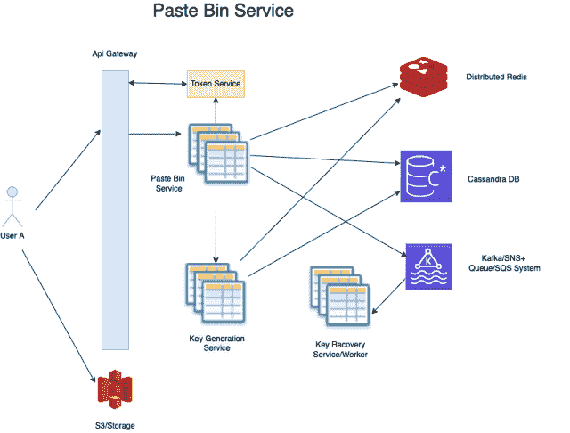

# Pastebin 系统设计

> 原文：[`techbyexample.com/pastebin-system-design/`](https://techbyexample.com/pastebin-system-design/)

目录

+   概览

+   功能性需求

+   非功能性需求

+   容量估算

    +   流量估算

    +   数据估算

    +   文本上传

    +   图片上传

+   数据库架构

    +   文本存储

    +   图片存储

    +   用户表

    +   Paste 表

+   如何生成唯一的 URL

+   高级设计

+   Paste Bin 服务

    +   上传

    +   下载

+   密钥生成服务

    +   数据库架构

    +   使用哪个数据库

    +   如何解决并发问题

    +   如何恢复 key_prefix

    +   如果密钥范围耗尽会发生什么

    +   如果 PasteBin 永不过期会怎样

    +   KGS 服务不是单点故障吗？

+   其他常见组件

+   非功能性需求

    +   可扩展性

    +   低延迟

    +   可用性

    +   告警与监控

    +   向用户位置靠近

    +   避免单点故障

+   结论

## **概览**

首先，让我们来看一下**Pastebin**的定义。Pastebin 服务允许你通过链接共享文本和图片，这些链接可以与多个用户共享。所以，基本上**Pastebin**是一种允许你通过链接暂时共享数据的服务。

需求分析是任何系统设计问题中的关键部分。它分为两个部分。

+   **功能需求** – 定义业务需求

+   **非功能需求** – 定义系统的质量属性，如性能、可扩展性、安全性等。

让我们来看一下 **Pastebin** 服务的一些功能性和非功能性需求。

## **功能需求**

+   用户应该能够粘贴文本或上传图像，并通过粘贴本服务生成的唯一 URL 与其他人共享该文本或图像

+   用户应该能够为 URL 设置过期时间。如果没有指定，默认过期时间为 1 周

+   用户可以是登录状态或匿名状态

+   用户应该能够登录并查看自己生成的粘贴本

+   其他用户可以在访问粘贴 URL 时访问粘贴的文本内容或图像。

## **非功能需求**

+   系统应该具有高持久性。一旦生成的唯一 URL 应该能够持续存在。

+   系统应该具备强一致性。这意味着一旦生成粘贴本，系统应该能够在下一个即时请求中返回该粘贴本。

+   系统应该具有高可用性

+   系统应该具备容错能力

+   系统应该没有单点故障

## **容量估算**

我们将对三项内容进行容量估算

+   网络估算

+   数据估算

+   流量估算

### **流量估算**

+   假设每日活跃用户数为 200K

+   创建的粘贴本数量 – 200K

+   每个创建的粘贴本被读取 10 次。总读取量 = 200K*10 = 2000K

所以我们的系统比写操作更偏向读取操作 —— 所以每秒写入请求总数 = 200K/24*60*60 ~ 3 请求/秒。考虑到峰值流量 = 200 请求/秒。每秒读取请求总数 = 2000K/24*60*60 – 30 请求/秒。考虑到峰值流量 = 2000 请求/秒

### **数据估算**

+   在创建 Pastebin 时，用户可以指定文本或图像。假设用户允许的最大文本大小为 5MB，最大图像大小为 10MB。

+   同时，假设文本上传与图像上传的比例为 9:1

### **文本上传**

+   文本上传数量 = 180K

+   最大文本上传大小 – 5MB

+   平均文本上传大小 – 10KB

+   每日总大小 = 10KB * 180K = 每日 1.8 GB

+   假设没有粘贴会过期，那么 3 年所需的总大小为 = 1.8*3*365 ~= 2TB

### **图像上传**

+   图像上传数量 = 20K

+   最大文本上传大小 – 10MB

+   平均图像上传大小 – 100KB

+   每日总大小 = 100KB * 20K = 每日 2 GB

+   假设没有粘贴会过期，那么 3 年所需的总大小为 = 2*3*365 ~= 2.2TB

所需总大小 = 2TB + 2.2TB  ~= 4.2 TB（三年内）

## **数据库架构**

我们需要存储用户创建的每个粘贴本以及相应的文本或图像。如前所述，文本大小可以达到 5MB，图像大小可以达到 10MB。

我们不能将图像存储在数据库中，否则会是一个糟糕的设计，因为这样会涉及大量的数据库 IO。同时，如果文本的大小较大，存储文本也不应放入数据库。因此，以下策略可以用于文本和图像的存储。

### **文本存储**

+   如果文本小于 10 KB，则可以将其作为数据库的一部分存储。

+   如果不是，则文本将存储在 Blob 存储中。我们可以在这里使用 Amazon S3。S3 的链接将存储在数据库中

### **图像存储**

+   图像将始终存储在 S3 中

我们没有任何 ACID 要求，因此可以使用 No SQL 数据库来存储将要创建的粘贴。在这种情况下，我们可以使用 Cassandra 数据库。

我们将有以下表

+   用户表

+   粘贴表

### **用户表**

它将包含以下字段

+   **user_id**

+   **user_name**

+   **password_encrypted**

+   **created**

+   **updated**

### **粘贴表**

它将包含以下字段

+   **paste_id** – 它将是一个 UUID

+   **paste_type** – 它可以是文本或图像

+   **text** – 如果 paste_type 是文本并且文本大小小于 10KB，则将填充该字段

+   **s3_url** – 在两种情况下填充。如果 paste_type 是文本且文本大小大于 10KB，或者 paste_type 是图像时。

+   **user_id**

+   **created**

+   **updated**

## **如何生成唯一的 URL**

由于粘贴是为了创建并与其他用户共享，如果我们能够生成一个短链接以方便分享会更好。因此，我们现在将查看如何为粘贴生成短链接。为此，我们将有另一个服务，称为密钥生成服务，用于生成一个短密钥，该密钥将用于创建的粘贴 URL。

## **高层次设计**

高层次地，我们先讨论一下更高层次的流程以及将会存在的所有服务。

+   将会有一个 **API 网关**，所有用户的请求都会通过这个网关。

+   将会有一个 **Pastebin** 服务。该服务负责生成所有粘贴 URL。

+   将会有一个 **Key Generation Service** 服务，负责生成短密钥

+   **Pastebin** 服务将在需要新的密钥时调用密钥生成服务。

+   当 **Pastebin** 服务用尽所有密钥范围时，它将发布一个 Kafka/SNS 消息，说明密钥范围已被用尽。

+   该消息将由 **Key Recovery** 服务接收，该服务是一个工作进程。它将标记密钥范围为可用，这样可以再次选择该范围。该工作进程还将从数据库中删除所有密钥范围内创建的粘贴。

+   我们将缓存最新创建的粘贴，因为它们更有可能在创建后被共享和访问

以下是该服务的高层次图示

让我们看一下 **Paste Bin** 服务和 **Key Generation** 服务的一些细节

## **Paste Bin 服务**

这个服务将成为我们系统中所有 API 的接口。PasteBin 服务将暴露一个创建粘贴的 API，并且还会暴露一个读取粘贴的 API。

**创建粘贴** – 它将与密钥生成服务交互，获取短密钥。这些密钥将用于生成 URL。然后，它将为该粘贴在数据库中创建一个条目，并且还会在缓存中创建一个条目。

**读取粘贴** – 它将首先检查粘贴是否已存在于缓存中。如果存在，它将返回该粘贴；如果不存在，它将从数据库中获取粘贴。

提高创建和读取粘贴的效率：当文本是 KB 级别或粘贴中包含图片时，通过 PasteBin 服务创建和读取粘贴会面临挑战。在这种情况下，我们可以进行一种优化：直接将大文本或图片上传到 Blob 存储（如 Amazon S3 或 HDFS）。我们是如何做到的呢？

### **上传**

+   假设用户 A 想要创建一个包含图片的粘贴。客户端将向服务器发送请求，请求一个预签名 URL，以便客户端上传图片。

+   服务器将响应一个预签名 URL，其有效期可能是几小时。你可以阅读这篇文章了解预签名 URL 的相关信息：[`docs.aws.amazon.com/AmazonS3/latest/userguide/ShareObjectPreSignedURL.html`](https://docs.aws.amazon.com/AmazonS3/latest/userguide/ShareObjectPreSignedURL.html)。基本上，这个 URL 已经用令牌签名，因此可以直接用于上传，无需进一步的身份验证。这也叫做直接上传。服务器还将返回`image_id`。

+   客户端将把图片上传到该 URL。它将直接存储到 S3 中。

+   现在客户端将调用创建粘贴 API。在调用创建粘贴 API 时，它也会在请求体中传递`image_id`。服务器将接收到该`image_id`。由于它有`image_id`，它将知道与粘贴对应的图片已经上传到 Blob 存储，这里指的是 S3。它会在将粘贴保存到数据库时，将路径作为字段保存。

通过上述方法，我们避免了通过 PasteBin 服务传输大量的图片或文本字节，从而在成本和性能上进行了一种优化。

### **下载**

+   用户 A 已创建一个粘贴，并将与用户 B 共享。所以用户 B 将阅读该粘贴。

+   在读取时，过程正好相反。PasteBin 服务从缓存或数据库中获取粘贴内容。

+   一旦它获取到粘贴内容，它将检查是否包含大文本或图片。如果是，它将从数据库中获取 S3 位置。

+   然后，它会为该 S3 位置生成一个预签名 URL。客户端将同时返回粘贴信息和 S3 URL。

+   使用这个预签名 S3 URL，客户端可以直接下载相应的大粘贴或图片文件。

## **密钥生成服务**

将会有一个 KGS 服务，负责生成键。首先，让我们看看每个键的长度应该是多少。可能的长度选项为 6、7、8。只能使用 Base64 URL 安全字符来生成键。因此，

+   对于 6—我们有 64⁶ = 68.7 亿个选项

+   对于 7—我们有 64⁷ = 约 3500 亿个选项

+   对于 8—我们有 64⁸ = 万亿个选项

我们现在可以假设 687 亿条记录足够，所以我们可以为键分配 6 个字符。现在的问题是这些键如何在数据库中进行维护。如果我们在数据库中存储 687 亿条记录，可能会有太多条记录，且浪费资源。

一种选择是将键范围存储在数据库中。我们可以有一个 64 的范围，在该范围内仅存储前五个字符，这些字符将作为前缀，用于从该前缀生成的所有 64 个键。

假设我们有以下前缀

adcA2

然后可以从此生成下列 64 个键

+   **adcA2[a-z]** – 26 个键

+   **adcA2[A-Z]** – 26 个键

+   **adcA2[0-9]** – 10 个键

+   **adcA2[-_]** – 2 个键

我们可以将这些范围存储在数据库中。因此，对于 6 个字符，我们将总共在数据库中存储 64⁵ 条记录。键将通过键服务按范围和批次返回给 Tiny URL 服务。Tiny URL 服务然后使用此前缀生成 64 个键，并处理 64 个不同的创建短网址请求。这是优化，因为**PasteBin**服务只有在用尽所有 64 个键时才需要调用键生成服务。所以**PasteBin**服务将向键生成服务发出一次调用来生成 64 个短网址。接下来我们来看 KGS 服务的要点

+   数据库架构

+   使用哪个数据库

+   如何解决并发问题

+   如何恢复 key_prefix

+   如果键范围耗尽会发生什么情况

+   如果粘贴内容永不过期怎么办

+   KGS 服务不是单点故障吗？

### **数据库架构**

将只有一个表来存储键范围，即前缀。以下是该表中的字段

+   **key_prefix**

+   **key_length** – 目前始终为 6。这个字段存在，是为了在任何情况下需要 7 个长度的键时使用。

+   **used** – 如果为真，则表示键前缀当前正在使用中。如果为假，则表示可以使用。

+   **created**

+   **updated**

### **使用哪个数据库**

我们没有任何 ACID 要求，因此可以使用 No SQL 数据库。此外，我们可能还需要保存非常大的数据，所以 No SQL 可能更合适。这个系统将是一个写重型和读重型的系统。所以我们可以在这里使用**Cassandra 数据库**。我们可以根据数据库的容量估算来决定我们想要的分片数。每个分片也会被适当复制。

这里还有一个优化可以减少延迟。我们可以在缓存中重新填充空闲的键范围，KGS 服务可以直接从缓存中获取，而不是每次都去数据库。

### **如何解决并发问题**

很有可能发生两个请求看到相同的前缀或范围为空闲状态。由于多个服务器同时从密钥数据库读取，我们可能会遇到两个或多个服务器同时将相同的密钥视为空闲的情况。我们刚才提到的并发问题有两种方式可以解决。

+   两台或更多的服务器读取相同的密钥，但只有一台服务器能在数据库中将该**key_prefix**标记为已使用。并发性发生在数据库级别，即每一行在更新之前都会被锁定，我们可以在这里利用这一点。数据库将返回给服务器，告知记录是否已被更新。如果记录未被更新，则服务器可以获取新的密钥。如果记录已更新，则该服务器已获得正确的密钥。

+   另一种选择是使用一个事务，在一个事务中完成查找和更新。每次查找和更新都会返回一个唯一的 `key_prefix`。这可能不是推荐的选项，因为它会增加数据库的负担

### **如何恢复 key_prefix**

一旦 Tiny URL 服务耗尽了密钥范围，它将把该范围插入到另一个表中，经过 2 周后可以从中恢复并重新标记为空闲。我们可以确定，经过两周后这些密钥会是空闲的，因为我们设置了 2 周的过期时间。

### **如果密钥范围耗尽会发生什么**

这将是一个意外情况。将有一个后台工作进程检查密钥范围是否耗尽。如果是，它可以为 7 位长度的密钥生成新范围。但如何知道密钥范围是否耗尽呢？为了保持粗略计数，可能会有另一个表用来存储已使用密钥的用户数量。

+   每当 KGS 将一个范围分配给 Tiny URL 服务时，它会发布一条消息，该消息会被一个同步工作进程接收，该工作进程将减少已使用密钥的计数。

+   同样，每当一个范围是空闲的，我们可以增加这个计数器。

### **如果 PasteBin 永不过期会怎样**

很容易扩展上述服务来处理永不过期的粘贴内容。

+   只是我们的短字符串不会局限于 6 位字符。我们可以根据需要使用 7 位、8 位甚至 9 位字符。

+   将不提供**密钥恢复**服务

+   一旦**key_range**被分配，我们可以将其从密钥数据库中移除，因为它永远不需要被释放或恢复。

### **KGS 服务不是单点故障吗？**

为了防止这种情况发生，我们将对密钥数据库进行适当的复制。此外，服务本身将有多个应用服务器。我们还将设置适当的自动扩展机制，并可以进行灾难恢复管理。

## **其他常见组件**

其他常见组件可能包括

+   用户服务 – 它保存用户的个人信息。

+   令牌/认证服务 – 用户令牌的管理

+   短信服务 – 用于将任何类型的消息发送回用户。例如 – OTP

+   分析服务 – 这可以用来追踪任何类型的分析

## **非功能性需求**

现在让我们讨论一些非功能性需求。

### **可扩展性**

在上述设计中需要首先考虑的因素是可扩展性。系统中每个组件的可扩展性非常重要。以下是您可能会遇到的可扩展性挑战及其可能的解决方案：

+   **paste_bin**服务和**KGS**服务中的每台机器只能处理有限数量的请求。因此，每个服务都应该有合适的自动扩展设置，以便根据请求的数量，我们可以添加实例并在需要时进行自动扩展。

+   您的 Kafka/SNS 系统可能无法承受如此大的负载。我们可以进行水平扩展，但有其限度。如果这成为瓶颈，那么根据地理位置或用户 ID，我们可以拥有两个或更多这样的系统。可以使用服务发现来确定请求应该发送到哪个 Kafka 系统。

+   可扩展性的另一个重要因素是，我们设计系统时确保没有任何服务被过多的任务拖累。我们进行了关注点分离，并且在任何服务承担过多责任的地方，都进行了拆分。

### **低延迟**

+   我们可以缓存新创建的 paste，并设置一定的过期时间。每当一个 paste 被创建时，它更可能在短时间内被访问。这样可以减少许多读取请求的延迟。

+   我们还创建了键或键范围的批次。这可以防止 Paste Bin 服务每次都调用 KGS 服务，整体上提高了延迟表现。

+   还有一个优化可以在这里进行，以提高延迟。我们可以在缓存中重新填充空闲的键范围，KGS 服务可以直接从缓存中获取数据，而不是每次都去访问数据库。

### **可用性**

为了使系统具有高可用性，几乎所有组件都需要冗余/备份。以下是需要完成的一些事项。

+   对于我们的数据库，需要启用复制。每个主分片节点应该有多个从节点。

+   对于 Redis，我们也需要实现复制。

+   对于数据冗余，我们也可以实现多区域部署。如果某个区域出现故障，这将是其中一个好处。

+   还可以设置灾难恢复

### **警报和监控**

警报和监控也是非常重要的非功能性需求。我们应该监控每一个服务，并设置合适的警报。可以监控的内容包括：

+   API 响应时间

+   内存消耗

+   CPU 消耗

+   磁盘空间消耗

+   队列长度

+   ….

### **向用户位置靠近**

这里可以采用几种架构方案。其中之一是单元架构。您可以在这里阅读更多关于单元架构的内容：[`github.com/wso2/reference-architecture/blob/master/reference-architecture-cell-based.md`](https://github.com/wso2/reference-architecture/blob/master/reference-architecture-cell-based.md)

### **避免单点故障**

单点故障是指系统中某个部分停止工作时，会导致整个系统崩溃的情况。我们在设计时应该尽量避免任何单点故障。通过冗余设计和多区域部署，我们可以防止这种情况发生。

## **结论**

这篇文章是关于**Pastebin**服务的系统设计。希望你喜欢这篇文章。请在评论中分享反馈。
