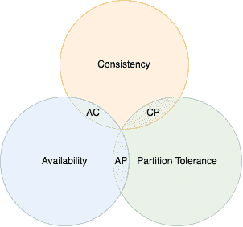

# 分布式系统中的 CAP 定理

> 原文：[`techbyexample.com/cap-theorem-distributed-systems/`](https://techbyexample.com/cap-theorem-distributed-systems/)

目录

+   概述

    +   一致性

    +   可用性

    +   分区容忍

+   CAP 定理

    +   一致性与可用性

    +   一致性与分区容忍

    +   可用性与分区容忍

+   强一致性的公式

    +   节点或副本的数量

    +   写入法定人数

    +   读取法定人数

+   节点数量为 1

+   节点数量为 2

    +   写入法定人数为 2，读取法定人数为 1

    +   写入法定人数为 1，读取法定人数为 2

    +   写入法定人数为 2，读取法定人数为 2

    +   写入法定人数为 1，读取法定人数为 1

+   CAP 定理的证明

    +   如何在牺牲可用性的情况下实现一致性

    +   如何在牺牲一致性的情况下实现可用性

+   结论

## **概述**

分布式系统是由多个节点通过网络相互连接的系统。CAP 定理是分布式系统中的一个基本定理，包含三项内容

+   C 代表一致性

+   A 代表可用性

+   P 代表分区容忍性

该定理指出，你只能实现提到的三个目标中的两个。为什么会这样呢？在理解为什么只能实现其中两个之前，让我们先理解一下上述每个术语的含义。

### **一致性**

这意味着所有节点的数据是一致的。本质上，所有节点看到的数据视图是相同的。所以每次读取都将返回最新的写入数据。一旦某个值的写入成功，随后的读取将返回该值。

### **可用性**

你的分布式系统应该能够在合理的时间内对每一个请求发送一个无错误的响应。这个响应不一定是最新的。

### **分区容忍性**

当发生网络分区时，系统仍然可以继续工作。这意味着，即使节点之间存在网络问题，出现消息失败、数据包丢失，系统仍然会继续运行。并不是系统会关闭。换句话说，系统是容忍网络分区的。

理想情况下，系统应该容忍网络分区。

现在我们已经理解了所有术语，让我们看看 CAP 定理是如何描述的。

## **CAP 定理**

CAP 定理指出，在一个分布式系统中，你只能实现上述三个属性中的两个。

+   CA

+   CP

+   AP

换句话说，分布式系统不可能在同一时间内既是一致的、可用的，又是容忍分区的。

下面的图表中进行了说明

### **一致性和可用性**

如果你的系统不容忍网络分区，那么它有可能同时实现一致性和可用性。

### **一致性和分区容忍性**

如果你的系统容忍网络分区，那么你可以以牺牲可用性的代价来实现一致性。

### **可用性和分区容忍性**

如果你的系统容忍网络分区，那么你可以以牺牲一致性的代价来实现可用性。

正如我们之前提到的，系统必须是分区容忍的，因为网络必然会失败，节点之间的通信必定会中断。系统应该在网络失败或消息丢失的情况下继续运行。因此，**P**对于系统来说应该始终为真，因此我们只能实现**C**或**A**中的一个。换句话说，当你的系统是**分区容忍**时，只有**一致性**或**可用性**可以实现。

让我们通过一个示例来理解为什么当系统是**分区容忍**时，必须牺牲**一致性**或**可用性**中的一个。在本教程中，我们将通过一个示例来证明 CAP 定理。

但是即便要正确理解示例，我们首先需要准确理解**CAP**中的**一致性**一词。当我们在这里提到一致性时，我们指的是强一致性。

如果一个系统强一致，它就会读取到最新的写入数据。它永远不会返回过时或陈旧的值。举个例子，假设有一个分布式系统，包含两个节点。我们将看到一致性情况和不一致性情况的示例。

**一致性案例示例**

节点 n0 和 n1 都包含数据项'A'的值为 1。从任一节点读取都将返回'A'的值为 1。现在，'A'的值在两个节点上都被更新为 2。再次从任一节点读取，将返回'A'的值为 2。一切都是一致的。

**不一致性案例示例**

节点 n0 和 n1 都包含数据项 ‘A’ 的值为 1\. 从任一节点读取都会返回值为 1\. 现在，‘A’ 的值在第一个节点上更新为 2，但在第二个节点上没有更新。因此，从第一个节点读取将返回值为 2，而从第二个节点读取将返回值为 1。这是一个不一致状态的例子

现在让我们来看强一致性的公式

## **强一致性的公式**

要理解数据库中的强一致性，我们首先需要理解三个术语

+   节点或副本的数量

+   写入法定人数

+   读取法定人数

### **节点或副本的数量**

这是你系统中存在的节点数量。这里所说的节点，实质上指的是具有相同数据的副本数量

### **写入法定人数**

这是写入成功返回之前必须进行写入的最小节点数量。

### **读取法定人数**

这是读取发生之前必须进行写入的最小节点数量。如果这些最小节点返回的值不同，则该读取将被拒绝

从数学角度看，如果 **写入法定人数** 和 **读取法定人数** 之和大于读取节点的数量，那么系统被认为是强一致的。

也就是说，如果写入法定人数为 W，读取法定人数为 R，节点数量为 N，那么

+   如果 W+R > N，则系统是强一致的

+   如果 W+R<=N，则系统无法保证强一致性

换句话说，如果写入法定人数节点和读取法定人数节点之间有一个共同节点，那么系统将是强一致的。这个共同节点将拒绝过时的读取。当 W+R > N 时，写入法定人数和读取法定人数之间总会有一个共同节点。从数学上来说，为什么是这样并不难理解。

让我们通过一些例子来看这个公式是如何成立的。我们将看到以下几种情况。

+   节点数量为 1

+   节点数量为 2

+   节点数量为 3

## **节点数量为 1**

在这种情况下，唯一可能的写入和读取法定人数组合是 1 和 1\. 写入法定人数和读取法定人数之和大于读取节点的数量。由于只有一个实例，读取总是最新的，因为读取和写入都发生在同一个实例上

## **节点数量为 2**

在此，有进一步的四种情况。

+   写入法定人数为 2，读取法定人数为 1 – **强一致性**

+   写入法定人数为 1，读取法定人数为 2 – **强一致性**

+   写入法定人数为 2，读取法定人数为 2 – **强一致性**

+   写入法定人数为 1，读取法定人数为 1 – **不强一致**

### **写入法定人数为 2，读取法定人数为 1**

在这种情况下，写入法定人数和读取法定人数之和为 3，这大于节点数量，因此系统应该是强一致的。在这种情况下，由于写入发生在两个节点上，因此从任一节点读取都将返回相同的数据，系统整体将是强一致的

### **写入法定人数为 1，读取法定人数为 2**

再次强调，在这种情况下，写操作法定数和读操作法定数的和为 3，这大于节点的数量，因此系统应该是强一致性的。在这种情况下，写操作只在一个节点上进行。但是，读操作来自两个节点。假设有一个名为 A 的数据，它的初始值是 1。两个节点的 A 的值都是 1。现在，在第一个节点上发生了写操作，将 A 的值更改为 2。由于写操作法定数是 1，因此写操作将在第一个节点上执行并成功返回。假设在节点 2 同步到节点 1 上的最新数据之前，发生了一次读操作。由于读操作法定数是 2，因此它将从两个节点读取数据。第一个节点将返回 A 的值为 2，而第二个节点将返回 A 的值为 1。由于两个节点返回的值不相同，系统将拒绝此次读操作，以保持强一致性。

### **写操作法定数是 2，读操作法定数是 2**

再次强调，在这种情况下，写操作法定数和读操作法定数的和为 4，这大于节点的数量，因此系统应该是强一致性的。在这种情况下，由于写操作发生在两个节点上，且读操作也来自两个节点。因此，每次读取都会是最新的。

### **写操作法定数是 1，读操作法定数是 1**

再次强调，在这种情况下，写操作法定数和读操作法定数的和为 2，等于节点的数量，因此系统不是强一致性的。写操作发生在节点 1 上。数据还没有同步到节点 2 时，节点 2 上发生了读操作。这个读操作的数据是过时的。

## **CAP 定理的证明**

现在你已经了解了强一致性，让我们更好地理解一下 CAP 定理。假设系统中有两个节点，它们相互连接并且保持同步。

正如我们从上面的公式中已经知道的，当系统有两个节点时，它将会是强一致性的，当

+   写操作法定数是 2，读操作法定数是 1

+   写操作法定数是 1，读操作法定数是 2

+   写操作法定数是 2，读操作法定数是 2

系统将不会是强一致性的，当

+   写操作法定数是 1，读操作法定数是 1

我们之前提到过，在一个具有分区容忍性的分布式系统中，只有在一致性或可用性之间做出选择。让我们来看一下是如何实现的。假设两个节点之间发生了网络分区，并且第二个节点不可用。

### **如何以牺牲可用性来实现一致性**

这里节点的数量是 2。因此，为了实现强一致性，我们有三种选择

+   写操作法定数是 2，读操作法定数是 1

+   写操作法定数是 1，读操作法定数是 2

+   写操作法定数是 2，读操作法定数是 2

在第一种情况中，由于写操作法定数是 2，因此必须写入两个节点。但由于第二个节点不可用，写操作将被拒绝。因此，系统在写操作上不可用。

在第二种情况下，由于读操作法定人数为 2，因此必须从两个节点读取数据。但是，由于第二个节点不可用，因此会拒绝读取操作。因此，系统在读取操作上不可用。

在第三种情况下，由于写操作法定人数为 2，因此必须向两个节点写入数据；同时，由于读操作法定人数为 2，因此必须从两个节点读取数据。但是，由于第二个节点不可用，因此会拒绝读写操作。因此，系统在读写操作上都不可用。

从这三种情况中，可以推断出，在网络分区的情况下，我们以牺牲可用性为代价获得强一致性。因此，在这种情况下，我们只能实现**C**和**P**。在任何情况下我们都无法获得**A**。

### **如何以牺牲一致性为代价实现可用性**

为了实现可用性，我们必须放弃一致性。这里的节点数量为 2。因此，有一种情况系统将不具备强一致性。

+   写操作法定人数（Write Quorum）为 1，读操作法定人数（Read Quorum）为 1

在第一种情况下，由于写操作法定人数为 1，因此可以向节点 1 写入数据。同时，由于读操作法定人数为 1，因此可以从节点 1 读取数据。因此，系统是可用的。写操作法定人数和读操作法定人数的总和为 2，等于节点的数量。根据公式，当写操作法定人数和读操作法定人数的总和小于等于节点的数量时，系统就不具备强一致性。因此，在这种情况下，系统是可用的，但不一致。

因此，在这种情况下我们只能实现**A**和**P**。我们无法获得**C**。

这是 CAP 定理的证明

## **结论**

这就是分布式系统中的 CAP 定理。希望你喜欢这篇文章。请在评论中分享反馈。

**注意：** 查看我们的系统设计教程系列 [系统设计问题](https://techbyexample.com/system-design-questions/)
