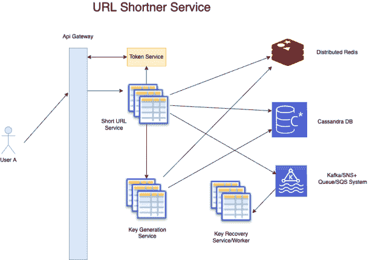

# 设计一个像 bit.ly 的 URL 缩短服务

> 原文：[`techbyexample.com/url-shortner-system-design/`](https://techbyexample.com/url-shortner-system-design/)

目录

+   概述

+   API 详情

+   短 URL 如何重定向到长 URL

+   编码方案

    +   MD5 方法

    +   计数器方法

    +   密钥范围

+   高级设计

+   短 URL 服务

    +   使用什么数据库

+   密钥生成服务

    +   数据库架构

    +   使用什么数据库

    +   如何解决并发问题

    +   如何恢复 key_prefix

    +   如果密钥范围用尽会发生什么

    +   如果短 URL 永不过期会怎样

    +   KGS 服务不是单点故障吗？

+   其他常见组件

+   非功能性需求

    +   可扩展性

    +   低延迟

    +   可用性

    +   告警和监控

    +   靠近用户位置

    +   避免单点故障

+   结论

## **概述**

URL 缩短服务用于缩短一个长的 URL。短 URL 的长度不会依赖于实际 URL 的长度。

+   [`techbyexample/system-design/whatsapp-system-design`](https://techbyexample/system-design/whatsapp-system-design)应该缩短为[`bit.ly/sdfse43`](https://bit.ly/sdfse43)

+   [`google.com/search/`](https://google.com/search/)可以缩短为[`bit.ly/wrewr34`](https://bit.ly/wrewr34)

请注意 bit.ly 中的 URL 第二部分。它将始终是固定长度，无论输入 URL 的长度如何。我们来记录下系统的功能需求

+   无论输入 URL 的长度如何，你都应该能够生成固定长度的短 URL。

+   一旦点击了短网址，它应该能够将用户重定向到实际的网址。

+   每个网址应该有一个过期时间。之后，短网址将过期

+   我们还将考虑一种情况，在本教程中，短网址永不过期

以下是一些非功能需求

+   系统应该具有高可用性

+   系统应该具有强一致性。这意味着，一旦为给定长网址生成了短网址，那么在下次调用时，系统应该能够根据短网址返回该长网址。

+   系统应该具有容错能力

+   系统中不应有单点故障

短网址应该是什么样子的？在我们查看要求之前，先看一个示例网址。以下是一些要求

+   它必须简短且唯一。最好长度为 6-8 个字符

+   它应该只包含 URL 安全的字符。以下是 URL 安全字符

    +   小写字母 – “a-z”

    +   大写字母 – “A-Z”

    +   数字 – “0-9”

    +   点 – “.”

    +   与符号 – “~”

    +   下划线 – “_”

    +   连字符 – “-”

这是一个短网址的示例，它包含 7 个字符作为短字符串的一部分。

```go
https://bit.ly/sdfse43
```

## **API 详情**

以下是系统中所需的 API

+   **创建短网址** – 该 API 将根据长网址创建短网址

+   **删除短网址** – 该 API 将用于删除之前创建的短网址

+   **获取网址** – 该 API 将在给定短网址时重定向到长网址

+   **列出短网址** – 查看某个特定用户的所有短网址

## **短网址如何重定向到长网址**

一旦我们的服务接收到短网址，它将获取该短网址对应的长网址或原始网址。这里有两种情况

+   如果不存在，它将向浏览器返回 404 资源未找到的响应

+   如果存在，它将向浏览器发出 HTTP 302 重定向。**Location 响应**头将包含长网址或原始网址。浏览器将随后重定向到长网址。这是 HTTP 协议中规定的标准重定向方式

实现短网址服务的最重要部分之一是生成短网址字符串。在查看解决方案之前，我们先看看可以用于生成短网址字符串的编码方案

## **编码方案**

设计一个唯一的短字符来表示给定长网址有三种解决方案

+   MD5

+   计数器

+   密钥范围

### **MD5 方法**

我们将有一个 MD5 函数，它会为给定的长网址返回一个唯一的字符串。MD5 字符串是 128 位的固定长度。我们可以取前 42 位来表示它为 7 个 base64 字符。每个 base64 字符占 6 位，因此 6*7=42 位。我们也可以取前 48 位来表示它为 8 个 base64 字符。**如何防止冲突**

如你所见，MD5 方法的最大问题是碰撞。两个长 URL 可能会产生相同的前 42 位 MD5 值。那么我们如何检测碰撞呢？我们首先对给定的长 URL 进行 MD5 运算，然后取前 42 位生成 7 个 base64 字符的字符串。接着，我们检查该字符串在数据库中是否已被使用。如果已经被使用，我们就取第 2 到 43 位进行检查。

**优点**

+   MD5 方法的最大优点是它实现起来非常简单。

+   如果是一个只需要生成少量短网址的系统，并且短网址生成是异步的，那么这个方案可能会非常有效，因为碰撞较少，即使发生了碰撞，由于整体过程是异步的，我们仍然有时间处理下一个短网址。

**缺点**

+   正如我们所见，这个解决方案并不具有可扩展性。如果需要在几秒钟内生成大量短网址，且发生了大量碰撞时，系统的性能可能会大幅下降。

### **计数器方法**

正如我们已经看到的，将 base10 数字转换为 base64 字符串是可行的。计数器本质上就是一个 base10 数字。因此，如果我们有一种方法为给定的长 URL 生成唯一数字，那么我们就能够生成短网址。问题是我们如何生成这个唯一的计数器或数字。这个思路是拥有一个空闲数字范围的列表。为此，我们可以再有一个服务，通过 API 返回可以使用的空闲数字范围。

**优点**：

+   这是一个可扩展的选项，适用于任何流量巨大的服务。

**缺点**

+   将一个 base10 数字转换为 base64 不会得到固定长度的字符串。例如，将 100,000 转换为 base64 会得到**“Yag”**。这可能没问题，但一个专业的短网址生成服务应该采用标准。此缺点可以通过选择产生 6 位或 7 位 Base64 字符串的数字范围来规避。

+   每次将数字转换为 base64 时都会有一定的转换成本，尽管这种转换成本可能不会产生实质性的影响。

+   相比于 MD5，这个方法稍微复杂一点。

### **密钥范围**

第三种选择是使用密钥范围本身，而不是计数器范围。

**优点**：

+   这是一个可扩展的选项，适用于任何流量巨大的服务。

**缺点**

+   相比于 MD5，这个方法稍微复杂一点。

计数器和密钥范围都是不错的选择。在本教程中，我们将考虑密钥范围的方式。

## **高级设计**

从高层次上讲，我们来讨论一下更高层次的流程以及将会有哪些服务存在。

+   会有一个**API 网关**，所有用户的请求都会先到达此网关。

+   会有一个**短网址**服务。该服务负责处理所有来自用户的 API 请求。

+   会有一个**密钥生成服务**，它负责生成短网址的密钥。

+   **短网址** 服务将会在每次需要新密钥时调用密钥生成服务。

+   当 **短网址** 服务耗尽所有密钥范围时，它将发布一个 Kafka/SNS 消息，指定密钥范围已耗尽。

+   这条消息将由**密钥恢复**服务处理，该服务将作为一个工作进程。它会将密钥范围标记为可用，从而可以再次选择该范围。该工作进程还将从数据库中删除该范围内所有密钥的 short_url – long_url 映射。

+   一旦创建 short_url 映射，我们将立即缓存该映射

以下是该服务的高层设计图



让我们来看看 **短网址** 服务和 **密钥生成** 服务的一些细节

## **短网址服务**

让我们来看看短网址服务需要哪些数据库。我们需要一个 short_url 表。以下是 **short_url** 表中的字段

+   **short_url_key**

+   **long_url**

+   **user_id**

+   **created**

+   **已更新**

### **使用什么数据库**

由于我们没有任何 ACID 要求，所以 NoSQL 数据库适合我们使用。此外，我们可能需要保存非常大的数据，因此 NoSQL 可能更合适。这个系统将是一个写重和读重的系统。而且，这里几乎没有二级索引需求，几乎所有查询都将基于主字段 **short_url_key**。所以我们可以在这里使用 **Cassandra 数据库**。

如高层图所示，短网址将负责跟踪所有生成的短网址。它将与密钥生成服务协调，以获取空闲密钥范围。每个密钥可以生成一个短网址。现在让我们看看 **密钥生成服务** 的设计

## **密钥生成服务**

将有一个 KGS 服务，负责生成密钥。首先，我们来看一下每个密钥的长度应为多少。可选的长度为 6、7、8。生成密钥时只能使用 base64 URL 安全字符。因此

+   对于 6 - 我们有 64⁶ = 687 亿种选项

+   对于 7 - 我们有 64⁷ = ~3500 亿种选项

+   对于 8 - 我们有 64⁸ = 万亿种选项

现在我们可以假设 687 亿条记录已经足够，因此我们可以使用 6 个字符作为密钥。现在的问题是这些数据将如何在数据库中维护。如果我们将 687 亿条记录存储到数据库中，那么可能会有太多条记录，从而浪费资源。一个选项是将密钥范围存储到数据库中。我们可以存储 64 个范围，只存储前五个字符，作为所有从该前缀生成的 64 个密钥的前缀。例如，我们有以下前缀

```go
adcA2
```

然后，可以从此生成以下 64 个密钥

+   **adcA2[a-z]** – 26 个密钥

+   **adcA2[A-Z]** – 26 个密钥

+   **adcA2[0-9]** – 10 个密钥

+   **adcA2[-_]** – 2 个密钥

我们可以将这些范围存储在数据库中。所以对于 6 个字符的情况，数据库中将总共存储 64⁵ 个条目。键将由键服务按范围和批次返回给短网址服务。短网址服务随后将使用这个前缀生成 64 个键，并处理 64 个不同的创建短网址请求。

这是优化，因为短网址服务只需要在它已经用完所有 64 个键时才调用键生成服务。因此，短网址服务将发出一次调用到键生成服务，用于生成 64 个短网址。

现在让我们来看一下 KGS 服务的要点。

+   数据库架构

+   使用哪个数据库

+   如何解决并发问题

+   如何恢复 key_prefix

+   如果键范围被耗尽了，会发生什么情况

+   如果短网址永不过期怎么办

+   KGS 服务难道不是单点故障吗？

### **数据库架构**

只会有一个表来存储键的范围，即前缀。下表将包含该表中的字段。

+   **key_prefix**

+   **key_length** – 目前它将始终为 6。如果在任何情况下我们需要 7 位长度的键，这些字段会存在。

+   **已使用** – 如果为真，则表示该键前缀当前正在使用。如果为假，则表示它可以被使用。

+   **已创建**

+   **更新**

### **使用哪个数据库**

我们没有 ACID 要求，因此可以使用 No SQL 数据库。此外，我们可能需要保存非常大的数据，所以 No SQL 数据库可能更适合。这个系统将是一个既写重也读重的系统。因此，我们可以在这里使用**Cassandra 数据库**。我们可以做数据库的容量估算，并基于此来决定我们希望拥有的分片数量。每个分片都会被适当的复制。

这里我们还可以进行一次优化，以提高延迟。我们可以在缓存中重新填充空闲的键范围，KGS 服务可以直接从中获取，而不是每次都访问数据库。

### **如何解决并发问题**

很有可能会发生两个请求看到相同的前缀或范围是空闲的。由于多个服务器同时从键数据库读取，我们可能会遇到两台或更多服务器从键数据库读取到相同的空闲键范围。我们刚才提到的并发问题有两种方式可以解决。

+   两台或更多服务器读取相同的键，但只有一台服务器能够在数据库中将该**key_prefix**标记为已使用。并发控制在数据库级别，也就是说每一行在更新之前都会被锁定，我们可以在这里利用这一点。数据库会返回给服务器是否有记录被更新。如果记录没有被更新，则服务器可以获取一个新的键。如果记录被更新，那么该服务器就获得了正确的键。

+   另一种选择是使用事务，在一个事务中进行查找和更新。每次查找和更新都会返回一个唯一的 key_prefix。这可能不是一个推荐的选择，因为它会给数据库带来负载。

### **如何恢复 key_prefix**

一旦 Tiny URL 服务用尽了密钥范围，它将把该范围输入到另一个表中，经过两周后，密钥将被恢复并重新作为免费密钥提供。我们可以确定，在两周后，密钥将是免费的，因为我们设置了两周的到期时间。

### **如果密钥范围用尽会发生什么？**

这将是一个意外的情况。将有一个后台工作者检查密钥范围是否用尽。如果是，它可以生成 7 位长度的密钥范围。但是，如何知道密钥范围是否用尽呢？为了保持大致的计数，可能会有另一个表格来存储已使用密钥的用户计数。

+   每当 KGS 为 Tiny URL 服务分配一个范围时，它会发布一条消息，该消息将被一个同步工作者拾取，工作者将减少已使用密钥的数量。

+   同样，每当一个范围变为空时，我们可以递增该计数器。

### **如果短网址永不过期会怎样？**

扩展上述服务以支持永不过期的 URL 是很容易的。

+   只不过我们的短字符串将不再局限于 6 个字符。根据需要，我们可以使用 7 位、8 位甚至 9 位长度的字符。

+   不会提供**密钥恢复**服务

+   一旦**密钥范围**被分配，我们可以将其从密钥数据库中移除，因为它不再需要释放或恢复。

### **KGS 服务不是单点故障吗？**

为了防止这种情况，我们将对密钥数据库进行适当的复制。此外，服务本身还将有多个应用服务器。我们还会设置适当的自动扩展机制。我们还可以实施灾难管理。

## **其他常见组件**

其他常见组件可能包括：

+   用户服务——存储用户的个人信息。

+   令牌/认证服务——用于管理用户令牌。

+   短信服务——用于向用户发送任何类型的消息。例如：一次性密码（OTP）

+   分析服务——这可以用于跟踪任何类型的分析数据。

## **非功能性需求**

现在让我们讨论一些非功能性需求。

### **可扩展性**

上述设计中需要考虑的第一件事是可扩展性因素。系统中每个组件的可扩展性非常重要。以下是可能遇到的可扩展性挑战及其可能的解决方案。

+   **短网址**服务和**KGS**服务中的每台机器只能处理有限数量的请求。因此，每个服务应设置适当的自动扩展机制，以便根据请求数量，我们可以增加实例并在需要时自动扩展。

+   你的 Kafka/SNS 系统可能无法承受这么大的负载。我们可以进行水平扩展，但也有一个限制。如果这成为瓶颈，那么根据地理位置或用户 ID，我们可以设置两个或更多这样的系统。可以使用服务发现来确定请求应该发送到哪个 Kafka 系统。

+   可扩展性的另一个重要因素是，我们设计了系统的方式，使得没有任何服务被过多的任务拖慢。我们有关注点的分离，在服务责任过重的地方，我们将其拆分开来。

### **低延迟**

+   我们可以缓存创建的短网址，并设置一定的过期时间。每当一个短网址被创建时，它很可能会在一段时间内被访问。这将减少许多读取请求的延迟。

+   我们还创建了键或键范围的批次。这防止了短网址服务每次都调用 KGS 服务，从而整体上提高了延迟。

+   还有一个优化可以改善延迟。我们可以在缓存中重新填充空闲的键范围，KGS 服务可以直接从那里获取，而不是每次都访问数据库。

### **可用性**

为了使系统具有高可用性，几乎所有组件都必须具有冗余/备份。以下是需要执行的一些事项。

+   在我们的数据库中，我们需要启用复制功能。每个主分片节点应该有多个从节点。

+   对于 Redis，我们也需要启用复制。

+   对于数据冗余，我们也可以采用多区域部署。如果其中一个区域发生故障，这可以作为一个优势。

+   灾难恢复也可以设置

### **警报与监控**

警报与监控也是非常重要的非功能性需求。我们应当监控我们的每一个服务并设置合适的警报。可以监控的一些内容包括：

+   API 响应时间

+   内存使用情况

+   CPU 使用情况

+   磁盘空间使用情况

+   队列长度

+   ….

### **靠近用户位置**

这里有几种架构可以选择，其中之一是单元架构。你可以在这里阅读更多关于单元架构的信息 – [`github.com/wso2/reference-architecture/blob/master/reference-architecture-cell-based.md`](https://github.com/wso2/reference-architecture/blob/master/reference-architecture-cell-based.md)

### **避免单点故障**

单点故障是指当系统的某一部分停止工作时，会导致整个系统的故障。我们在设计时应尽量避免单点故障。通过冗余和多区域部署，我们可以防止这种情况的发生。

## **总结**

这就是 URL 缩短服务的系统设计。希望你喜欢这篇文章。请在评论中提供反馈。
