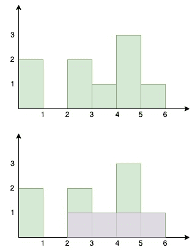

# 直方图中的最大矩形面积

> 原文：[`techbyexample.com/histogram-largest-rectangular-area/`](https://techbyexample.com/histogram-largest-rectangular-area/)

## **概述**

有一组每根宽度为 1 单位但高度不同的柱子并排放置。柱子的高度通过数组表示

```go
[2, 0 , 2, 1, 3, 1]
```

数组表示的是

+   柱子的总数是 5

+   第一根柱子的高度是 2

+   第二根柱子的高度是 0

+   第三根柱子的高度是 2

+   第四根柱子的高度是 1

+   第五根柱子的高度是 3

+   第六根柱子的高度是 1

目标是找到直方图中的最大矩形面积。从图示可以看到，最大矩形面积是 4。



以下是我们可以采取的方法来解决此问题。我们将使用栈并在每个柱子的索引处找到矩形面积，假设该柱子完全包含在最大矩形中。

+   将给定数组的第一个元素推入栈中。遍历给定的数组。对于每根柱子，我们需要找到左侧最近的较小柱子和右侧最近的较小柱子

+   对于当前元素，检查栈顶元素的高度是否大于当前元素的高度

+   如果是，那么当前元素就是右侧最近的较小柱子。栈顶元素之后的元素是左侧最近的较小柱子。

+   弹出该元素并计算最大矩形面积，假设该柱子完全包含在矩形内。跟踪最大矩形面积

+   重复上述两个步骤，直到栈为空或栈顶元素的高度小于当前元素

+   将当前元素推入栈中

+   最后返回最大矩形面积。

## **程序**

以下是相应的程序。

```go
package main

import "fmt"

type customStack struct {
	stack []int
}

func (c *customStack) Push(num int) {
	c.stack = append(c.stack, num)
}

func (c *customStack) Pop() (int, error) {
	length := len(c.stack)
	poppedItem := 0
	if length > 0 {
		poppedItem = c.stack[length-1]
		c.stack = c.stack[:length-1]
		return poppedItem, nil
	}
	return 0, fmt.Errorf("stack is empty")
}

func (c *customStack) Front() (int, error) {
	length := len(c.stack)
	if length > 0 {
		return c.stack[length-1], nil
	}
	return 0, fmt.Errorf("stack is empty")
}

func (c *customStack) Size() int {
	return len(c.stack)
}

func largestRectangleArea(heights []int) int {
	customStack := &customStack{}

	lenHeights := len(heights)

	customStack.Push(0)

	maxRectangleSize := heights[0]

	for i := 1; i < lenHeights; i++ {

		for customStack.Size() != 0 {
			current, _ := customStack.Front()
			if heights[current] > heights[i] {
				var rectangleUsingCurrentBar int
				current, _ := customStack.Pop()
				//Calcualte max rectangle using the current front
				previous, err := customStack.Front()
				if err != nil {
					previous = -1
				}
				rectangleUsingCurrentBar = (i - previous - 1) * heights[current]
				if rectangleUsingCurrentBar > maxRectangleSize {
					maxRectangleSize = rectangleUsingCurrentBar
				}
			} else {
				break
			}
		}
		customStack.Push(i)
	}

	front, err := customStack.Front()
	if err != nil {
		return maxRectangleSize
	}
	var rectangleUsingCurrentBar int
	for customStack.Size() != 0 {
		current, _ := customStack.Pop()
		previous, err := customStack.Front()
		if err != nil {
			previous = -1
		}
		rectangleUsingCurrentBar = (front - previous) * heights[current]
		if rectangleUsingCurrentBar > maxRectangleSize {
			maxRectangleSize = rectangleUsingCurrentBar
		}
	}
	return maxRectangleSize
}

func main() {
	output := largestRectangleArea([]int{2, 0, 2, 1, 3, 1})
	fmt.Println(output)
} 
```

**输出**

```go
4
```
