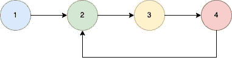

# 检测链表中循环起始节点的程序

> 原文：[`techbyexample.com/program-detect-cycle-linked-list/`](https://techbyexample.com/program-detect-cycle-linked-list/)

## **概述**

目标是找出给定链表中的循环起始节点。如果链表中的最后一个节点指向前面的某个节点，则链表中存在循环。

示例



上面的链表有一个循环，循环的起始节点是节点 2。下面是我们可以遵循的方法。

+   首先，检测给定的链表是否有循环。使用两个指针，一个是慢指针，另一个是快指针。两者最初都指向头节点。

+   现在，慢指针每次移动 1 个节点，快指针每次移动 2 个节点。

```go
slow := slow.Next
fast := fast.Next.Next
```

+   如果慢指针和快指针在任何时刻相同，则说明链表中有循环。

+   快指针和慢指针只能在循环内的某个节点相遇。假设它们在节点 3 相遇。现在，获取循环的长度。长度是 3。

+   然后，将一个指针保持在头节点，另一个指针与它保持与循环长度相等的距离。所以，一个指针将位于节点 1，另一个指针将位于节点 4。

+   移动两个指针，直到它们相同。它们将在循环的起始节点相遇，该节点是节点 2。

## **程序**

以下是相应的程序。

```go
package main

import "fmt"

func main() {
	first := initList()
	ele4 := first.AddFront(4)
	first.AddFront(3)
	ele2 := first.AddFront(2)
	first.AddFront(1)

	//Create cycle
	ele4.Next = ele2

	output := cycleStartNode(first.Head)
	fmt.Println(output.Val)

}

type ListNode struct {
	Val  int
	Next *ListNode
}

type SingleList struct {
	Len  int
	Head *ListNode
}

func (s *SingleList) AddFront(num int) *ListNode {
	ele := &ListNode{
		Val: num,
	}
	if s.Head == nil {
		s.Head = ele
	} else {
		ele.Next = s.Head
		s.Head = ele
	}
	s.Len++
	return ele
}

func initList() *SingleList {
	return &SingleList{}
}
func cycleStartNode(head *ListNode) *ListNode {
	if head == nil || head.Next == nil {
		return nil
	}

	slow := head
	fast := head

	cycleExists := false

	for slow != nil && fast != nil && fast.Next != nil {
		slow = slow.Next
		fast = fast.Next.Next

		if slow == fast {
			cycleExists = true
			break
		}
	}

	if !cycleExists {
		return nil
	}

	cycleNode := slow

	curr := cycleNode

	lengthCycle := 1

	for curr.Next != cycleNode {
		lengthCycle++
		curr = curr.Next
	}

	curr = head

	for i := 0; i < lengthCycle; i++ {
		curr = curr.Next
	}

	for head != curr {
		head = head.Next
		curr = curr.Next
	}

	return head
}
```

**输出**

```go
2
```
