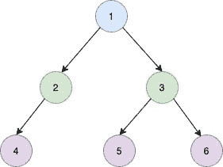

# 二叉树的先序遍历

> 原文：[`techbyexample.com/preorder-traversal-of-a-binary-tree/`](https://techbyexample.com/preorder-traversal-of-a-binary-tree/)

## **概览**

在二叉树的先序遍历中，我们遵循以下顺序

+   访问根节点

+   访问左子树

+   访问右子树

例如，假设我们有如下的二叉树



那么先序遍历的结果将会是

```go
[1 2 4 3 5 6]
```

## **程序**

这是相应的程序

```go
package main

import (
	"fmt"
)

type TreeNode struct {
	Val   int
	Left  *TreeNode
	Right *TreeNode
}

func preorderTraversal(root *TreeNode) []int {
	if root == nil {
		return nil
	}

	left := preorderTraversal(root.Left)
	right := preorderTraversal(root.Right)

	output := make([]int, 0)

	output = append(output, root.Val)
	output = append(output, left...)
	output = append(output, right...)
	return output
}

func main() {
	root := TreeNode{Val: 1}
	root.Left = &TreeNode{Val: 2}
	root.Left.Left = &TreeNode{Val: 4}
	root.Right = &TreeNode{Val: 3}
	root.Right.Left = &TreeNode{Val: 5}
	root.Right.Right = &TreeNode{Val: 6}

	output := preorderTraversal(&root)
	fmt.Println(output)

}
```

**输出**

```go
[1 2 4 3 5 6]
```
