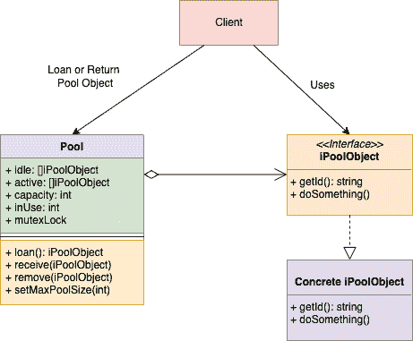

# 面试问题：设计一个对象池

> 原文：[`techbyexample.com/design-object-pool/`](https://techbyexample.com/design-object-pool/)

目录

+   概述

+   当我们需要创建一个对象池时

+   UML 图

+   低级设计

+   程序

+   完整工作代码：

+   结论

## **概述**

对象池设计模式可以用来设计对象池。它是一种创建型设计模式，其中对象池在预先初始化并创建好后被保存在池中。需要时，客户端可以从池中请求一个对象，使用后再将其归还到池中。池中的对象永远不会被销毁。在本教程中，我们将看到

+   当我们需要创建一个对象池时

+   设计的 UML 图

+   低级设计

+   完整的工作代码

## **当我们需要创建一个对象池时**

+   当类的对象创建成本较高，且在特定时间内需要的此类对象数量不多时。

-以数据库连接为例。每个连接对象的创建成本较高，因为涉及网络调用，而且一次只需要有限数量的连接。对象池设计模式非常适用于这种情况。

+   当池对象是不可变对象时

-再以数据库连接为例。数据库连接是一个不可变的对象。几乎没有它的任何属性需要更改。

+   出于性能考虑。这将显著提升应用程序的性能，因为池已经创建好。

## **UML 图**

以下是对象池设计的 UML 图



这里是总体思路

+   我们有一个**Pool**类，它负责管理**Pool**对象。**Pool**类首先通过一组已经创建的固定数量的池对象进行初始化。然后它支持借出、归还和移除池对象。

+   有一个接口**iPoolObject**，它表示将驻留在池中的对象类型。根据使用场景的不同，这个接口会有不同的实现。例如，在数据库连接的情况下，数据库连接会实现该**iPoolObject**接口。

+   有一个**客户端**类，它使用**Pool**类借用一个**Pool Object**。当它使用完**Pool Object**后，会将其归还给池。

## **低级设计**

以下是用 Go 编程语言表示的低级设计。稍后我们还将看到一个完整的示例。

**iPoolObject 接口**

```go
type iPoolObject interface {
    getID() string
    doSomething()
}
```

**DBConnection 类**

```go
type dbconnection struct {
    id string
}

func (c *dbconnection) getID() string 

func (c *dbconnection) doSomething()
```

**Pool 类**

```go
type pool struct {
    idle   []iPoolObject
    active []iPoolObject
    capacity int
    mulock   *sync.Mutex
}

//InitPool Initialize the pool
func initPool(poolObjects []iPoolObject) (*pool, error) {}

func (p *pool) loan() (iPoolObject, error) {}

func (p *pool) receive(target iPoolObject) error {}

func (p *pool) remove(target iPoolObject) error {}

func (p *pool) setMaxCapacity(capacity int){}
```

**客户端类**

```go
type client struct {
    pool *pool
}

func (c *client) init() {}

func (c *client) doWork() {} 
```

## **程序**

这里是完整的工作代码，如果有任何人对 Go 编程语言感兴趣的话。

**iPoolObject.go**

```go
package main

type iPoolObject interface {
	getID() string //This is any id which can be used to compare two different pool objects
	doSomething()
}
```

**dbconnection.go**

```go
package main

import "fmt"

type dbconnection struct {
	id string
}

func (c *dbconnection) getID() string {
	return c.id
}

func (c *dbconnection) doSomething() {
	fmt.Printf("Connection with id %s in action\n", c.getID())
}
```

**pool.go**

```go
package main

import (
	"fmt"
	"sync"
)

type pool struct {
	idle     []iPoolObject
	active   []iPoolObject
	capacity int
	mulock   *sync.Mutex
}

//InitPool Initialize the pool
func initPool(poolObjects []iPoolObject) (*pool, error) {
	if len(poolObjects) == 0 {
		return nil, fmt.Errorf("Cannot craete a pool of 0 length")
	}
	active := make([]iPoolObject, 0)
	pool := &pool{
		idle:     poolObjects,
		active:   active,
		capacity: len(poolObjects),
		mulock:   new(sync.Mutex),
	}
	return pool, nil
}

func (p *pool) loan() (iPoolObject, error) {
	p.mulock.Lock()
	defer p.mulock.Unlock()
	if len(p.idle) == 0 {
		return nil, fmt.Errorf("No pool object free. Please request after sometime")
	}
	obj := p.idle[0]
	p.idle = p.idle[1:]
	p.active = append(p.active, obj)
	fmt.Printf("Loan Pool Object with ID: %s\n", obj.getID())
	return obj, nil
}

func (p *pool) receive(target iPoolObject) error {
	p.mulock.Lock()
	defer p.mulock.Unlock()
	err := p.remove(target)
	if err != nil {
		return err
	}
	p.idle = append(p.idle, target)
	fmt.Printf("Return Pool Object with ID: %s\n", target.getID())
	return nil
}

func (p *pool) remove(target iPoolObject) error {
	currentActiveLength := len(p.active)
	for i, obj := range p.active {
		if obj.getID() == target.getID() {
			p.active[currentActiveLength-1], p.active[i] = p.active[i], p.active[currentActiveLength-1]
			p.active = p.active[:currentActiveLength-1]
			return nil
		}
	}
	return fmt.Errorf("Targe pool object doesn't belong to the pool")
}

func (p *pool) setMaxCapacity(capacity int) {
	p.capacity = capacity
}
```

**client.go**

```go
package main

import (
	"fmt"
	"log"
	"strconv"
)

type client struct {
	pool *pool
}

func (c *client) init() {
	connections := make([]iPoolObject, 0)
	for i := 0; i < 3; i++ {
		c := &dbconnection{id: strconv.Itoa(i)}
		connections = append(connections, c)
	}
	var err error
	c.pool, err = initPool(connections)
	if err != nil {
		log.Fatalf("Init Pool Error: %s", err)
	}
}

func (c *client) doWork() {
	fmt.Printf("Capacity: %d\n\n", c.pool.capacity)

	conn1, err := c.pool.loan()
	if err != nil {
		log.Fatalf("Pool Loan Error: %s", err)
	}
	conn1.doSomething()

	fmt.Printf("InUse: %d\n\n", c.pool.inUse)
	conn2, err := c.pool.loan()
	if err != nil {
		log.Fatalf("Pool Loan Error: %s", err)
	}
	conn2.doSomething()
	fmt.Printf("InUse: %d\n\n", c.pool.inUse)

	c.pool.receive(conn1)
	fmt.Printf("InUse: %d\n\n", c.pool.inUse)

	c.pool.receive(conn2)
	fmt.Printf("InUse: %d\n", c.pool.inUse)
}
```

**main.go**

```go
package main

func main() {
    client := &client{}
    client.init()
    client.doWork()
}
```

**输出**

```go
Capacity: 3

Loan Pool Object with ID: 0
Connection with id 0 in action
InUse: 1

Loan Pool Object with ID: 1
Connection with id 1 in action
InUse: 2

Return Pool Object with ID: 0
InUse: 1

Return Pool Object with ID: 1
InUse: 0
```

## **完整工作代码：**

这里是一个文件中的完整工作代码

**main.go**

```go
package main

import (
	"fmt"
	"log"
	"strconv"
	"sync"
)

type pool struct {
	idle     []iPoolObject
	active   []iPoolObject
	capacity int
	inUse    int
	mulock   *sync.Mutex
}

//InitPool Initialize the pool
func initPool(poolObjects []iPoolObject) (*pool, error) {
	if len(poolObjects) == 0 {
		return nil, fmt.Errorf("Cannot craete a pool of 0 length")
	}
	active := make([]iPoolObject, 0)
	pool := &pool{
		idle:     poolObjects,
		active:   active,
		capacity: len(poolObjects),
		mulock:   new(sync.Mutex),
	}
	return pool, nil
}

func (p *pool) loan() (iPoolObject, error) {
	p.mulock.Lock()
	defer p.mulock.Unlock()
	if len(p.idle) == 0 {
		return nil, fmt.Errorf("No pool object free. Please request after sometime")
	}
	obj := p.idle[0]
	p.idle = p.idle[1:]
	p.active = append(p.active, obj)
	p.inUse = p.inUse + 1
	fmt.Printf("Loan Pool Object with ID: %s\n", obj.getID())
	return obj, nil
}

func (p *pool) receive(target iPoolObject) error {
	p.mulock.Lock()
	defer p.mulock.Unlock()
	err := p.remove(target)
	if err != nil {
		return err
	}
	p.idle = append(p.idle, target)
	p.inUse = p.inUse - 1
	fmt.Printf("Return Pool Object with ID: %s\n", target.getID())
	return nil
}

func (p *pool) remove(target iPoolObject) error {
	currentActiveLength := len(p.active)
	for i, obj := range p.active {
		if obj.getID() == target.getID() {
			p.active[currentActiveLength-1], p.active[i] = p.active[i], p.active[currentActiveLength-1]
			p.active = p.active[:currentActiveLength-1]
			return nil
		}
	}
	return fmt.Errorf("Targe pool object doesn't belong to the pool")
}

func (p *pool) setMaxCapacity(capacity int) {
	p.capacity = capacity
}

type iPoolObject interface {
	getID() string //This is any id which can be used to compare two different pool objects
	doSomething()
}

type dbconnection struct {
	id string
}

func (c *dbconnection) getID() string {
	return c.id
}

func (c *dbconnection) doSomething() {
	fmt.Printf("Connection with id %s in action\n", c.getID())
}

type client struct {
	pool *pool
}

func (c *client) init() {
	connections := make([]iPoolObject, 0)
	for i := 0; i < 3; i++ {
		c := &dbconnection{id: strconv.Itoa(i)}
		connections = append(connections, c)
	}
	var err error
	c.pool, err = initPool(connections)
	if err != nil {
		log.Fatalf("Init Pool Error: %s", err)
	}
}

func (c *client) doWork() {
	fmt.Printf("Capacity: %d\n\n", c.pool.capacity)

	conn1, err := c.pool.loan()
	if err != nil {
		log.Fatalf("Pool Loan Error: %s", err)
	}
	conn1.doSomething()

	fmt.Printf("InUse: %d\n\n", c.pool.inUse)
	conn2, err := c.pool.loan()
	if err != nil {
		log.Fatalf("Pool Loan Error: %s", err)
	}
	conn2.doSomething()
	fmt.Printf("InUse: %d\n\n", c.pool.inUse)

	c.pool.receive(conn1)
	fmt.Printf("InUse: %d\n\n", c.pool.inUse)

	c.pool.receive(conn2)
	fmt.Printf("InUse: %d\n", c.pool.inUse)
}

func main() {
	client := &client{}
	client.init()
	client.doWork()
}
```

**输出**

```go
Capacity: 3

Loan Pool Object with ID: 0
Connection with id 0 in action
InUse: 1

Loan Pool Object with ID: 1
Connection with id 1 in action
InUse: 2

Return Pool Object with ID: 0
InUse: 1

Return Pool Object with ID: 1
InUse: 0
```

## **结论**

这篇文章主要介绍了对象池的设计。希望你喜欢这篇文章。请在评论中分享反馈
