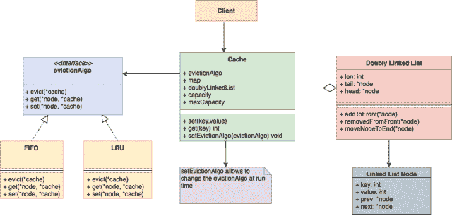

# LRU 缓存设计。

> 原文：[`techbyexample.com/lru-cache-design/`](https://techbyexample.com/lru-cache-design/)

目录

+   概述

+   Set(key int, value int)") 

+   Get(key int)")

+   低级设计

+   UML 图

+   程序

+   结论

## **概述**

在本教程中，我们还将考虑在设计中使用 **FIFO** 方法，除了 **LRU** 之外，以确保设计在运行时可以灵活地切换到任何算法。

目标是设计一个内存缓存。以下是要求：

+   它应该支持 **Set** 和 **Get** 操作。

+   **Set** 和 **Get** 操作的时间复杂度为 O(1)。

+   假设缓存的最大容量是 3。一旦缓存已满且需要插入一个新键时，必须从缓存中删除一个现有条目。

+   删除操作应该基于逐出算法 —— FIFO 或 LRU。

+   假设缓存中的键和值的类型为字符串。

+   它应该支持的逐出算法是 **先进先出（FIFO）** 和 **最近最少使用（LRU）**。

+   逐出算法应该是可插拔的。这意味着你应该能够在运行时更改逐出算法。

以下是我们设计中的高级内容：

+   我们将有一个 **Cache** 类，作为与客户端交互的接口。

+   **Cache** 类将使用 **Map** 和 **双向链表** 的组合来存储所有内容。使用这两种数据结构，确保在逐出操作时，**Get** 和 **Set** 操作的时间复杂度仍为 O(1)。我们将在本教程后面详细介绍如何实现这一点。

+   **Map** 将具有类型为字符串的键和类型为指向 **双向链表** 中节点的指针的值。

+   **双向链表** 的每个节点将包含键和值。每个节点还会有指向前一个节点的指针以及指向下一个节点的指针，在 **双向链表** 中。

+   将会有一个 **evictionAlgorithm** 接口。将会有 **LRU** 和 **FIFO** 类实现该 **evictionAlgorithm** 接口。

+   **Cache** 类还会嵌入一个 **evictionAlgorithm** 接口实例。

**evictionAlgorithm** 接口存在的目的是将 **Cache** 类与算法解耦，以便我们能够在运行时更改算法。此外，当添加新算法时，**Cache** 类不应发生变化。这就是 **策略设计模式** 的应用场景。策略模式建议创建一组算法，每个算法有自己独立的类。这些类遵循相同的接口，使得算法可以在同一家族内互换。假设公共接口名称为 **evictionAlgo**，那么 **FIFO** 和 **LRU** 类将实现此接口。

现在我们的主 **Cache** 类将嵌入 **evictionAlgo** 接口。我们的缓存类不会实现所有类型的驱逐算法，而是将所有算法委托给 **evictionAlgo** 接口。由于 evictionAlgo 是一个接口，我们可以在运行时将算法切换为 LRU 或 FIFO，而无需修改 Cache 类。

同时，我们将使用工厂设计模式来创建每个算法的实例，例如 FIFO、LRU。

让我们来看一下 Get 和 Set 如何在 O(1) 时间内工作。

## **Set(key int, value int)**

对于任何 set 操作，它将首先创建一个包含输入的键和值的双向链表节点。然后会在映射中创建一个条目，其中键是输入的键，值是节点的地址。一旦节点创建完成，就会有两种情况。

+   **缓存未满** – 在这种情况下，它将控制权交给当前的 evictionAlgorithm 接口。evictionAlgorithm 接口将根据当前的驱逐算法，将节点插入到双向链表的末尾或前端。这里的每个操作都是 O(1)。

+   **缓存已满** – 在这种情况下，它将控制权交给当前的 evictionAlgorithm 接口，根据当前的驱逐算法驱逐一个节点。一旦该节点被驱逐，它将插入新节点。这里的每个操作都是 O(1)。

## **Get(key int)**

对于任何 Get 操作，它首先会检查映射中是否存在给定的键。如果存在，它将获取映射中由该键指向的节点的地址。然后，它会从该节点中获取值。接下来，它会将控制权交给当前的 evictionAlgorithm 接口。evictionAlgorithm 接口将根据当前的驱逐算法，将当前节点在双向链表中移动到末尾或前端。这里的每个操作都是 O(1)。

## **低级设计**

以下是用 Go 编程语言表达的低级设计。稍后我们还将看到 UML 图以及一个工作示例。

**缓存类**

```go
type cache struct {
	dll          *doublyLinkedList
	storage      map[string]string
	evictionAlgo evictionAlgo
	capacity     int
	maxCapacity  int
}

func (c *cache) setEvictionAlgo(e evictionAlgo)

func (c *cache) add(key, value string)

func (c *cache) get(key string)

func (c *cache) evict()
```

**双向链表**

```go
type node struct {
    data string
    prev *node
    next *node
}

type doublyLinkedList struct {
    len  int
    tail *node
    head *node
}

func initDoublyList() *doublyLinkedList {
    return &doublyLinkedList{}
}

func (d *doublyLinkedList) AddFrontNodeDLL(data string) 

func (d *doublyLinkedList) AddEndNodeDLL(data string) 

func (d *doublyLinkedList) MoveToFront(node *node) error 

func (d *doublyLinkedList) MoveToBack(node *node) error

func (d *doublyLinkedList) Size() int
```

**驱逐算法接口**

```go
type evictionAlgo interface {
	evict(c *cache)
}

func createEvictioAlgo(algoType string) evictionAlgo
```

**FIFO 算法** – 它实现了驱逐算法接口

```go
type fifo struct {
}

func (l *fifo) evict(c *cache)
```

**LRU 算法** – 它实现了驱逐算法接口

```go
type lru struct {
}

func (l *lru) evict(c *cache)
```

## **UML 图**



## **程序**

这里是完整的 Go 编程语言代码，如果有任何人感兴趣的话。

**doublylinklist.go**

```go
package main

import "fmt"

type node struct {
	key   string
	value string
	prev  *node
	next  *node
}

type doublyLinkedList struct {
	len  int
	tail *node
	head *node
}

func initDoublyList() *doublyLinkedList {
	return &doublyLinkedList{}
}

func (d *doublyLinkedList) AddToFront(key, value string) {
	newNode := &node{
		key:   key,
		value: value,
	}
	if d.head == nil {
		d.head = newNode
		d.tail = newNode
	} else {
		newNode.next = d.head
		d.head.prev = newNode
		d.head = newNode
	}
	d.len++
	return
}

func (d *doublyLinkedList) RemoveFromFront() {
	if d.head == nil {
		return
	} else if d.head == d.tail {
		d.head = nil
		d.tail = nil
	} else {
		d.head = d.head.next
	}
	d.len--
}

func (d *doublyLinkedList) AddToEnd(node *node) {
	newNode := node
	if d.head == nil {
		d.head = newNode
		d.tail = newNode
	} else {
		currentNode := d.head
		for currentNode.next != nil {
			currentNode = currentNode.next
		}
		newNode.prev = currentNode
		currentNode.next = newNode
		d.tail = newNode
	}
	d.len++
}
func (d *doublyLinkedList) Front() *node {
	return d.head
}

func (d *doublyLinkedList) MoveNodeToEnd(node *node) {
	prev := node.prev
	next := node.next

	if prev != nil {
		prev.next = next
	}

	if next != nil {
		next.prev = prev
	}
	if d.tail == node {
		d.tail = prev
	}
	if d.head == node {
		d.head = next
	}
	node.next = nil
	node.prev = nil
	d.len--
	d.AddToEnd(node)
}

func (d *doublyLinkedList) TraverseForward() error {
	if d.head == nil {
		return fmt.Errorf("TraverseError: List is empty")
	}
	temp := d.head
	for temp != nil {
		fmt.Printf("key = %v, value = %v, prev = %v, next = %v\n", temp.key, temp.value, temp.prev, temp.next)
		temp = temp.next
	}
	fmt.Println()
	return nil
}

func (d *doublyLinkedList) Size() int {
	return d.len
}
```

**evictionAlgorithm.go**

```go
package main

type evictionAlgo interface {
	evict(c *Cache) string
	get(node *node, c *Cache)
	set(node *node, c *Cache)
	set_overwrite(node *node, value string, c *Cache)
}

func createEvictioAlgo(algoType string) evictionAlgo {
	if algoType == "fifo" {
		return &fifo{}
	} else if algoType == "lru" {
		return &lru{}
	}

	return nil
}
```

**lru.go**

```go
package main

import "fmt"

type lru struct {
}

func (l *lru) evict(c *Cache) string {
	key := c.doublyLinkedList.Front().key
	fmt.Printf("Evicting by lru strtegy. Evicted Node Key: %s: ", key)
	c.doublyLinkedList.RemoveFromFront()
	return key
}

func (l *lru) get(node *node, c *Cache) {
	fmt.Println("Shuffling doubly linked list due to get operation")
	c.doublyLinkedList.MoveNodeToEnd(node)
}

func (l *lru) set(node *node, c *Cache) {
	fmt.Println("Shuffling doubly linked list due to set operation")
	c.doublyLinkedList.AddToEnd(node)
}

func (l *lru) set_overwrite(node *node, value string, c *Cache) {
	fmt.Println("Shuffling doubly linked list due to set_overwrite operation")
	node.value = value
	c.doublyLinkedList.MoveNodeToEnd(node)
}
```

**fifo.go**

```go
package main

import "fmt"

type fifo struct {
}

func (l *fifo) evict(c *Cache) string {
	fmt.Println("Evicting by fifo strtegy")
	key := c.doublyLinkedList.Front().key
	c.doublyLinkedList.RemoveFromFront()
	return key
}

func (l *fifo) get(node *node, c *Cache) {
	fmt.Println("Shuffling doubly linked list due to get operation")
}

func (l *fifo) set(node *node, c *Cache) {
	fmt.Println("Shuffling doubly linked list due to set operation")
	c.doublyLinkedList.AddToEnd(node)
}

func (l *fifo) set_overwrite(node *node, value string, c *Cache) {
	fmt.Println("Shuffling doubly linked list due to set_overwrite operation")
}
```

**cache.go**

```go
package main

import "fmt"

type Cache struct {
	doublyLinkedList *doublyLinkedList
	storage          map[string]*node
	evictionAlgo     evictionAlgo
	capacity         int
	maxCapacity      int
}

func initCache(evictionAlgo evictionAlgo, maxCapacity int) Cache {
	storage := make(map[string]*node)
	return Cache{
		doublyLinkedList: &doublyLinkedList{},
		storage:          storage,
		evictionAlgo:     evictionAlgo,
		capacity:         0,
		maxCapacity:      maxCapacity,
	}
}

func (this *Cache) setEvictionAlgo(e evictionAlgo) {
	this.evictionAlgo = e
}

func (this *Cache) set(key, value string) {
	node_ptr, ok := this.storage[key]
	if ok {
		this.evictionAlgo.set_overwrite(node_ptr, value, this)
		return
	}
	if this.capacity == this.maxCapacity {
		evictedKey := this.evict()
		delete(this.storage, evictedKey)
	}
	node := &node{key: key, value: value}
	this.storage[key] = node
	this.evictionAlgo.set(node, this)
	this.capacity++
}

func (this *Cache) get(key string) string {
	node_ptr, ok := this.storage[key]
	if ok {
		this.evictionAlgo.get(node_ptr, this)
		return (*node_ptr).value
	}
	return ""
}

func (this *Cache) evict() string {
	key := this.evictionAlgo.evict(this)
	this.capacity--
	return key
}

func (this *Cache) print() {
	for k, v := range this.storage {
		fmt.Printf("key :%s value: %s\n", k, (*v).value)
	}
	this.doublyLinkedList.TraverseForward()
}
```

**main.go**

```go
package main

import "fmt"

func main() {
	lru := createEvictioAlgo("lru")
	cache := initCache(lru, 3)
	cache.set("a", "1")
	cache.print()

	cache.set("b", "2")
	cache.print()

	cache.set("c", "3")
	cache.print()

	value := cache.get("a")
	fmt.Printf("key: a, value: %s\n", value)
	cache.print()

	cache.set("d", "4")
	cache.print()

	cache.set("e", "5")
	cache.print()
}
```

**输出**

```go
Shuffling doubly linked list due to set operation
key :a value: 1
key = a, value = 1, prev = <nil>, next = <nil>

Shuffling doubly linked list due to set operation
key :a value: 1
key :b value: 2
key = a, value = 1, prev = <nil>, next = &{b 2 0xc00007e1e0 <nil>}
key = b, value = 2, prev = &{a 1 <nil> 0xc00007e210}, next = <nil>

Shuffling doubly linked list due to set operation
key :a value: 1
key :b value: 2
key :c value: 3
key = a, value = 1, prev = <nil>, next = &{b 2 0xc00007e1e0 0xc00007e2a0}
key = b, value = 2, prev = &{a 1 <nil> 0xc00007e210}, next = &{c 3 0xc00007e210 <nil>}
key = c, value = 3, prev = &{b 2 0xc00007e1e0 0xc00007e2a0}, next = <nil>

Shuffling doubly linked list due to get operation
key: a, value: 1
key :a value: 1
key :b value: 2
key :c value: 3
key = b, value = 2, prev = <nil>, next = &{c 3 0xc00007e210 0xc00007e1e0}
key = c, value = 3, prev = &{b 2 <nil> 0xc00007e2a0}, next = &{a 1 0xc00007e2a0 <nil>}
key = a, value = 1, prev = &{c 3 0xc00007e210 0xc00007e1e0}, next = <nil>

Evicting by lru strtegy. Evicted Node Key: %s:  b
Shuffling doubly linked list due to set operation
key :d value: 4
key :c value: 3
key :a value: 1
key = c, value = 3, prev = &{b 2 <nil> 0xc00007e2a0}, next = &{a 1 0xc00007e2a0 0xc00007e450}
key = a, value = 1, prev = &{c 3 0xc00007e210 0xc00007e1e0}, next = &{d 4 0xc00007e1e0 <nil>}
key = d, value = 4, prev = &{a 1 0xc00007e2a0 0xc00007e450}, next = <nil>

Evicting by lru strtegy. Evicted Node Key: %s:  c
Shuffling doubly linked list due to set operation
key :a value: 1
key :d value: 4
key :e value: 5
key = a, value = 1, prev = &{c 3 0xc00007e210 0xc00007e1e0}, next = &{d 4 0xc00007e1e0 0xc00007e570}
key = d, value = 4, prev = &{a 1 0xc00007e2a0 0xc00007e450}, next = &{e 5 0xc00007e450 <nil>}
key = e, value = 5, prev = &{d 4 0xc00007e1e0 0xc00007e570}, next = <nil>
```

## **结论**

这就是设计内存缓存的全部内容。希望你喜欢这篇文章。如果有任何反馈，请在评论中分享。

+   [cache](https://techbyexample.com/tag/cache/)*   [lru](https://techbyexample.com/tag/lru/)
