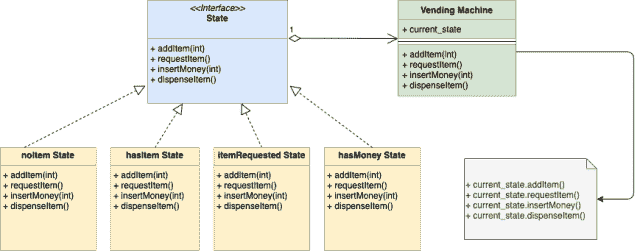

# 设计一个自动售货机

> 原文：[`techbyexample.com/vending-machine-design/`](https://techbyexample.com/vending-machine-design/)

**概述**

目标是设计一个自动售货机。请注意，设计自动售货机是一个面向对象的问题，而不是一个分布式系统问题。因此，我们需要以这种方式来处理它。以下是需求：

+   自动售货机会允许用户选择物品

+   自动售货机会允许管理员添加物品

+   一旦物品被选中，用户就可以投入金钱。物品将在输入金钱后被发放

+   自动售货机将有不同的状态。

为了简化，假设自动售货机只有一种物品或产品。同时，假设自动售货机可以处于 4 种不同的状态。

+   **hasItem**

+   **noItem**

+   **itemRequested**

+   **hasMoney**

**自动售货机还将有不同的操作。为了简化，假设只有四个操作：**

***   **选择物品**

+   **添加物品**

+   **投入金钱**

+   **发放物品**

我们可以在这里使用状态设计模式来设计自动售货机。状态设计模式是一种基于有限状态机的行为设计模式。

现在问题是，为什么我们要使用状态设计模式来设计自动售货机？以下是两个原因：

+   状态设计模式用于当一个对象可以处于多种不同的状态时。根据当前请求，对象需要改变其当前状态。

    +   自动售货机可以处于多种不同的状态。自动售货机会从一种状态转移到另一种状态。假设自动售货机处于**itemRequested**状态，然后在执行“插入金钱”操作后，它将转移到**hasMoney**状态。

+   状态设计模式用于当一个对象对相同的请求根据当前状态给出不同的响应时。在这里使用状态设计模式可以避免大量的条件语句。

    +   例如，在自动售货机的情况下，如果用户想购买物品，机器将在处于**hasItemState**状态时继续操作，而在处于**noItemState**状态时拒绝。如果你注意到，在购买物品的请求下，自动售货机会根据是否处于**hasItemState**或**noItemState**给出两种不同的响应。通过这种方式，我们的代码中不会有任何条件语句。所有逻辑都由具体的状态实现处理。

## **UML 图**

以下是自动售货机的 UML 图：



这是整体思路：

+   我们将拥有一个接口“State”，它定义了表示自动售货机中动作的函数签名。以下是这些动作的函数签名：

    1.  addItem(int) error

    1.  requestItem() error

    1.  insertMoney(money int) error

    1.  dispenseItem() error

+   每个具体状态都实现了上述四个函数，并根据这些操作转移到其他状态或给出一些响应。

+   每个具体的状态还会嵌入一个指向当前自动售货机对象的指针，这样状态转换可以在该对象上进行。

## **低级设计**

以下是用 Go 编程语言表达的低级设计，稍后我们还会看到一个实际的例子

**自动售货机类**

```go
type vendingMachine struct {
    hasItem       state
    itemRequested state
    hasMoney      state
    noItem        state

    currentState state

    itemCount int
    itemPrice int
}

func (v *vendingMachine) requestItem() error 

func (v *vendingMachine) addItem(count int) error 

func (v *vendingMachine) insertMoney(money int) error

func (v *vendingMachine) dispenseItem() error

func (v *vendingMachine) setState(s state) 

func (v *vendingMachine) incrementItemCount(count int)
```

**状态接口**

```go
type state interface {
    addItem(int) error
    requestItem() error
    insertMoney(money int) error
    dispenseItem() error
}
```

**无商品状态类**

```go
type noItemState struct {
    vendingMachine *vendingMachine
}

func (i *noItemState) requestItem() error 

func (i *noItemState) addItem(count int) error 

func (i *noItemState) insertMoney(money int) error

func (i *noItemState) dispenseItem() error 
```

**请求商品状态类**

```go
type itemRequestedState struct {
    vendingMachine *vendingMachine
}

func (i *itemRequestedState) requestItem() error

func (i *itemRequestedState) addItem(count int) error 

func (i *itemRequestedState) insertMoney(money int) error 

func (i *itemRequestedState) dispenseItem() error 
```

**有商品状态类**

```go
type hasItemState struct {
    vendingMachine *vendingMachine
}

func (i *hasItemState) requestItem() error 

func (i *hasItemState) addItem(count int) error 

func (i *hasItemState) insertMoney(money int) error 

func (i *hasItemState) dispenseItem() error 
```

**有钱状态类**

```go
type hasMoneyState struct {
    vendingMachine *vendingMachine
}

func (i *hasMoneyState) requestItem() error 

func (i *hasMoneyState) addItem(count int) error 

func (i *hasMoneyState) insertMoney(money int) error 

func (i *hasMoneyState) dispenseItem() error 
```

## **程序**

如果有人对 Go 编程语言感兴趣，这里是完整的工作代码

**vendingMachine.go**

```go
package main

import "fmt"

type vendingMachine struct {
    hasItem       state
    itemRequested state
    hasMoney      state
    noItem        state

    currentState state

    itemCount int
    itemPrice int
}

func newVendingMachine(itemCount, itemPrice int) *vendingMachine {
    v := &vendingMachine{
        itemCount: itemCount,
        itemPrice: itemPrice,
    }
    hasItemState := &hasItemState{
        vendingMachine: v,
    }
    itemRequestedState := &itemRequestedState{
        vendingMachine: v,
    }
    hasMoneyState := &hasMoneyState{
        vendingMachine: v,
    }
    noItemState := &noItemState{
        vendingMachine: v,
    }

    v.setState(hasItemState)
    v.hasItem = hasItemState
    v.itemRequested = itemRequestedState
    v.hasMoney = hasMoneyState
    v.noItem = noItemState
    return v
}

func (v *vendingMachine) requestItem() error {
    return v.currentState.requestItem()
}

func (v *vendingMachine) addItem(count int) error {
    return v.currentState.addItem(count)
}

func (v *vendingMachine) insertMoney(money int) error {
    return v.currentState.insertMoney(money)
}

func (v *vendingMachine) dispenseItem() error {
    return v.currentState.dispenseItem()
}

func (v *vendingMachine) setState(s state) {
    v.currentState = s
}
func (v *vendingMachine) incrementItemCount(count int) {
    fmt.Printf("Adding %d items\n", count)
    v.itemCount = v.itemCount + count
}
```

**state.go**

```go
package main

type state interface {
    addItem(int) error
    requestItem() error
    insertMoney(money int) error
    dispenseItem() error
}
```

**noItemState.go**

```go
package main

import "fmt"

type noItemState struct {
    vendingMachine *vendingMachine
}

func (i *noItemState) requestItem() error {
    return fmt.Errorf("Item out of stock")
}

func (i *noItemState) addItem(count int) error {
    i.vendingMachine.incrementItemCount(count)
    i.vendingMachine.setState(i.vendingMachine.hasItem)
    return nil
}

func (i *noItemState) insertMoney(money int) error {
    return fmt.Errorf("Item out of stock")
}
func (i *noItemState) dispenseItem() error {
    return fmt.Errorf("Item out of stock")
}
```

**itemRequestedState.go**

```go
package main

import "fmt"

type itemRequestedState struct {
    vendingMachine *vendingMachine
}

func (i *itemRequestedState) requestItem() error {
    return fmt.Errorf("Item already requested")
}

func (i *itemRequestedState) addItem(count int) error {
    return fmt.Errorf("Item Dispense in progress")
}

func (i *itemRequestedState) insertMoney(money int) error {
    if money < i.vendingMachine.itemPrice {
        fmt.Errorf("Inserted money is less. Please insert %d", i.vendingMachine.itemPrice)
    }
    fmt.Println("Money entered is ok")
    i.vendingMachine.setState(i.vendingMachine.hasMoney)
    return nil
}
func (i *itemRequestedState) dispenseItem() error {
    return fmt.Errorf("Please insert money first")
}
```

**hasItemState.go**

```go
package main

import "fmt"

type hasItemState struct {
    vendingMachine *vendingMachine
}

func (i *hasItemState) requestItem() error {
    if i.vendingMachine.itemCount == 0 {
        i.vendingMachine.setState(i.vendingMachine.noItem)
        return fmt.Errorf("No item present")
    }
    fmt.Printf("Item requestd\n")
    i.vendingMachine.setState(i.vendingMachine.itemRequested)
    return nil
}

func (i *hasItemState) addItem(count int) error {
    fmt.Printf("%d items added\n", count)
    i.vendingMachine.incrementItemCount(count)
    return nil
}

func (i *hasItemState) insertMoney(money int) error {
    return fmt.Errorf("Please select item first")
}
func (i *hasItemState) dispenseItem() error {
    return fmt.Errorf("Please select item first")
}
```

**hasMoneyState.go**

```go
package main

import "fmt"

type hasMoneyState struct {
    vendingMachine *vendingMachine
}

func (i *hasMoneyState) requestItem() error {
    return fmt.Errorf("Item dispense in progress")
}

func (i *hasMoneyState) addItem(count int) error {
    return fmt.Errorf("Item dispense in progress")
}

func (i *hasMoneyState) insertMoney(money int) error {
    return fmt.Errorf("Item out of stock")
}

func (i *hasMoneyState) dispenseItem() error {
    fmt.Println("Dispensing Item")
    i.vendingMachine.itemCount = i.vendingMachine.itemCount - 1
    if i.vendingMachine.itemCount == 0 {
        i.vendingMachine.setState(i.vendingMachine.noItem)
    } else {
        i.vendingMachine.setState(i.vendingMachine.hasItem)
    }
    return nil
}
```

**main.go**

```go
package main

import (
    "fmt"
    "log"
)

func main() {
    vendingMachine := newVendingMachine(1, 10)

    err := vendingMachine.requestItem()
    if err != nil {
        log.Fatalf(err.Error())
    }

    err = vendingMachine.insertMoney(10)
    if err != nil {
        log.Fatalf(err.Error())
    }

    err = vendingMachine.dispenseItem()
    if err != nil {
        log.Fatalf(err.Error())
    }

    fmt.Println()

    err = vendingMachine.addItem(2)
    if err != nil {
        log.Fatalf(err.Error())
    }

    fmt.Println()

    err = vendingMachine.requestItem()
    if err != nil {
        log.Fatalf(err.Error())
    }

    err = vendingMachine.insertMoney(10)
    if err != nil {
        log.Fatalf(err.Error())
    }

    err = vendingMachine.dispenseItem()
    if err != nil {
        log.Fatalf(err.Error())
    }
}
```

**输出：**

```go
Item requestd
Money entered is ok
Dispensing Item

Adding 2 items

Item requestd
Money entered is ok
Dispensing Item
```**
