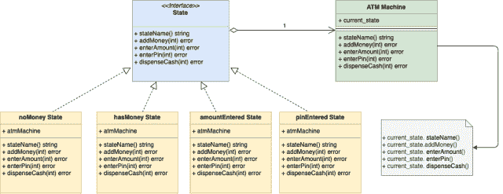

# 自动取款机系统设计

> 原文：[`techbyexample.com/atm-machine-system-design/`](https://techbyexample.com/atm-machine-system-design/)

目录

+   概述

+   UML 图

+   低级设计

+   程序

+   结论

## **概述**

目标是设计一个自动取款机。请注意，设计自动取款机是一个面向对象的问题，而不是分布式系统问题。因此我们需要以这种方式来处理。下面是需求。

+   自动取款机将允许管理员或银行添加资金

+   自动取款机将允许用户输入金额

+   一旦输入金额，用户可以输入密码。密码正确后，现金将被发放。

+   自动取款机将具有不同的状态。

同样，为了简单起见，假设自动取款机可以处于四种不同的状态。

+   **noMoney –** 这是自动取款机没有资金时的初始状态，因此无法接受提款。

+   **hasMoney –** 这是自动取款机准备接受提款时的下一个状态。

+   **amountEntered –** 这是用户输入金额后的状态。在此状态下，它将允许用户输入金额。

+   **pinEntered –** 这是用户输入密码后的状态。如果密码正确，则现金将被发放。

**自动取款机还会有不同的动作。为了简单起见，假设只有四个动作：**

***   **添加资金**

+   **输入金额**

+   **输入密码**

+   **发放现金**

我们可以在这里使用状态设计模式来设计自动取款机。状态设计模式是一种基于有限状态机的行为设计模式。

那么问题是，为什么我们要使用状态设计模式来设计自动取款机？下面是两个原因。

+   状态设计模式用于当对象可以处于多种不同的状态时。根据当前的请求，对象需要改变其当前状态。

    +   自动取款机可以处于多个不同的状态。假设自动取款机当前处于**amountEntered**状态，那么一旦执行了**“Enter Pin”**操作，它将转移到**pinEntered**状态。

+   状态设计模式用于当对象在不同的状态下对相同的请求有不同响应时。使用状态设计模式可以避免许多条件语句。

    +   例如，在自动取款机（ATM）的情况下，如果用户想要取款，则机器将在**hasMoney**状态下继续操作，或者如果处于**noMoney**状态则拒绝操作。如果你注意到这里，自动取款机在取款请求时，根据是否处于**hasMoney**或**noMoney**状态，会给出两种不同的响应。通过这种方式，我们的代码将不会有任何条件语句。所有的逻辑都由具体的状态实现来处理。

## **UML 图**

以下是 ATM 机器的 UML 图



这是整体的想法

+   我们将有一个接口“State”，它定义了表示 ATM 机器上下文中的操作的函数签名。以下是操作函数签名

    1.  stateName() string

    1.  addMoney(int) error

    1.  enterAmount(int) error

    1.  enterPin(money int) error

    1.  dispenseCash() error

+   每个具体状态都实现了上述所有 5 个功能，并根据这些操作要么转移到另一个状态，要么做出相应的响应。

+   每个具体状态还嵌入了指向当前 ATM 机器对象的指针，以便状态转换可以调用 ATM 机器对象上的某些方法。

## **低**–**级设计**

以下是用 Go 编程语言表达的低级设计。

稍后我们还会看到一个工作示例

**ATM 机器类**

```go
type atmMachine struct {
	hasMoney      state
	noMoney       state
	amountEntered state
	pinEntered    state

	currentState state

	totalMoney int
}

func newATMMachine(totalMoney int) *atmMachine {
	a := &atmMachine{
		totalMoney: totalMoney,
	}
	hasMoneyState := &hasMoneyState{
		atmMachine: a,
	}
	noMoneyState := &noMoneyState{
		atmMachine: a,
	}
	amountEnteredState := &amountEnteredState{
		atmMachine: a,
	}
	pinEnteredState := &pinEnteredState{
		atmMachine: a,
	}

	a.setState(hasMoneyState)
	a.hasMoney = hasMoneyState
	a.noMoney = noMoneyState
	a.amountEntered = amountEnteredState
	a.pinEntered = pinEnteredState
	return a
}

func (v *atmMachine) addMoney(money int) error 

func (v *atmMachine) enterAmount(money int) error 

func (v *atmMachine) enterPin(money int) error 

func (v *atmMachine) dispenseCash(money int) error 

func (v *atmMachine) setState(s state) 

func (v *atmMachine) incrementMoney(money int)

func (v *atmMachine) decrementMoney(money int) 

func (v *atmMachine) checkAvailability(money int) error 

func (v *atmMachine) verifyPin(pin int) error
```

**状态接口**

```go
type state interface {
	stateName() string
	addMoney(int) error
	enterAmount(int) error
	enterPin(int) error
	dispenseCash(int) error
}
```

**NoMoney 状态类**

```go
type noMoneyState struct {
	atmMachine *atmMachine
}

func (i *noMoneyState) stateName() string 

func (i *noMoneyState) addMoney(money int) error

func (i *noMoneyState) enterAmount(money int) error 

func (i *noMoneyState) enterPin(pin int) error 

func (i *noMoneyState) dispenseCash(money int) error 
```

**Has Money 状态类**

```go
type hasMoneyState struct {
	atmMachine *atmMachine
}

func (i *hasMoneyState) stateName() string 

func (i *hasMoneyState) addMoney(money int) error 

func (i *hasMoneyState) enterAmount(money int) error 

func (i *hasMoneyState) enterPin(pin int) error 

func (i *hasMoneyState) dispenseCash(money int) error 
```

**Amount 输入状态类**

```go
type amountEnteredState struct {
	atmMachine *atmMachine
}

func (i *amountEnteredState) stateName() string 

func (i *amountEnteredState) addMoney(money int) error 

func (i *amountEnteredState) enterAmount(money int) error 

func (i *amountEnteredState) enterPin(pin int) error 

func (i *amountEnteredState) dispenseCash(money int) error
```

**密码输入状态类**

```go
type pinEnteredState struct {
	atmMachine *atmMachine
}

func (i *pinEnteredState) stateName() string 

func (i *pinEnteredState) addMoney(money int) error 

func (i *pinEnteredState) enterAmount(money int) error 

func (i *pinEnteredState) enterPin(pin int) error 

func (i *pinEnteredState) dispenseCash(money int) error
```

## **程序**

这里是完整的工作代码，如果有人对 Go 编程语言感兴趣的话

**atmMachine.go**

```go
package main

import "fmt"

type atmMachine struct {
	hasMoney      state
	noMoney       state
	amountEntered state
	pinEntered    state

	currentState state

	totalMoney int
}

func newATMMachine(totalMoney int) *atmMachine {
	a := &atmMachine{
		totalMoney: totalMoney,
	}
	hasMoneyState := &hasMoneyState{
		atmMachine: a,
	}
	noMoneyState := &noMoneyState{
		atmMachine: a,
	}
	amountEnteredState := &amountEnteredState{
		atmMachine: a,
	}
	pinEnteredState := &pinEnteredState{
		atmMachine: a,
	}

	a.setState(hasMoneyState)
	a.hasMoney = hasMoneyState
	a.noMoney = noMoneyState
	a.amountEntered = amountEnteredState
	a.pinEntered = pinEnteredState
	return a
}

func (v *atmMachine) addMoney(money int) error {
	return v.currentState.addMoney(money)
}

func (v *atmMachine) enterAmount(money int) error {
	return v.currentState.enterAmount(money)
}

func (v *atmMachine) enterPin(money int) error {
	return v.currentState.enterPin(money)
}
func (v *atmMachine) dispenseCash(money int) error {
	return v.currentState.dispenseCash(money)
}

func (v *atmMachine) setState(s state) {
	v.currentState = s
}
func (v *atmMachine) incrementMoney(money int) {
	fmt.Printf("Adding %d money:\n", money)
	v.totalMoney = v.totalMoney + money
}

func (v *atmMachine) decrementMoney(money int) {
	fmt.Printf("Dispensing %d cash:\n", money)
	v.totalMoney = v.totalMoney - money
}

func (v *atmMachine) checkAvailability(money int) error {
	fmt.Printf("Checking Availability\n")
	if money < v.totalMoney {
		return nil
	}
	return fmt.Errorf("Not enough money")
}

func (v *atmMachine) verifyPin(pin int) error {
	fmt.Println("Verifying Pin")
	//Pin is always true
	return nil
}
```

**state.go**

```go
package main

type state interface {
	stateName() string
	addMoney(int) error
	enterAmount(int) error
	enterPin(int) error
	dispenseCash(int) error
}
```

**noMoneyState.go**

```go
package main

import "fmt"

type noMoneyState struct {
	atmMachine *atmMachine
}

func (i *noMoneyState) stateName() string {
	return "noMoneyState"
}

func (i *noMoneyState) addMoney(money int) error {
	fmt.Errorf("Add money in progress")
	i.atmMachine.incrementMoney(money)
	return nil
}

func (i *noMoneyState) enterAmount(money int) error {
	return fmt.Errorf("Add money first")
}

func (i *noMoneyState) enterPin(pin int) error {
	return fmt.Errorf("Add money first")
}
func (i *noMoneyState) dispenseCash(money int) error {
	return fmt.Errorf("Add money first")
}
```

**hasMoneyState.go**

```go
package main

import "fmt"

type hasMoneyState struct {
	atmMachine *atmMachine
}

func (i *hasMoneyState) stateName() string {
	return "hasMoneyState"
}

func (i *hasMoneyState) addMoney(money int) error {
	fmt.Errorf("Add money in progress")
	i.atmMachine.incrementMoney(money)
	return nil
}

func (i *hasMoneyState) enterAmount(money int) error {
	fmt.Errorf("Amount is entered. Amount:%n", money)
	err := i.atmMachine.checkAvailability(money)
	if err != nil {
		return err
	}
	i.atmMachine.setState(i.atmMachine.amountEntered)
	return nil
}

func (i *hasMoneyState) enterPin(pin int) error {
	return fmt.Errorf("First enter the amount")
}
func (i *hasMoneyState) dispenseCash(money int) error {
	return fmt.Errorf("First enter the amount")
}
```

**amountEnteredState.go**

```go
package main

import "fmt"

type amountEnteredState struct {
	atmMachine *atmMachine
}

func (i *amountEnteredState) stateName() string {
	return "amountEnteredState"
}

func (i *amountEnteredState) addMoney(money int) error {
	return fmt.Errorf("Dispensing process in progress")
}

func (i *amountEnteredState) enterAmount(money int) error {
	return fmt.Errorf("Amount already entered")
}

func (i *amountEnteredState) enterPin(pin int) error {
	err := i.atmMachine.verifyPin(pin)
	if err != nil {
		return err
	}
	i.atmMachine.setState(i.atmMachine.pinEntered)
	return nil
}
func (i *amountEnteredState) dispenseCash(money int) error {
	return fmt.Errorf("First Enter Pin")
}
```

**pinEnteredState.go**

```go
package main

import "fmt"

type pinEnteredState struct {
	atmMachine *atmMachine
}

func (i *pinEnteredState) stateName() string {
	return "pinEnteredState"
}

func (i *pinEnteredState) addMoney(money int) error {
	return fmt.Errorf("Dispensing process in progress")
}

func (i *pinEnteredState) enterAmount(money int) error {
	return fmt.Errorf("Amount and pin already entered")
}

func (i *pinEnteredState) enterPin(pin int) error {
	return fmt.Errorf("Pin already entered")
}
func (i *pinEnteredState) dispenseCash(money int) error {
	i.atmMachine.decrementMoney(money)
	i.atmMachine.setState(i.atmMachine.hasMoney)
	return nil
}
```

**main.go**

```go
package main

import (
	"fmt"
	"log"
)

func main() {
	atmMachine := newATMMachine(100)

	fmt.Println("<<<<<First Transactin: Withdrawing amount 10>>>> ")

	fmt.Printf("ATM current state %s\n\n", atmMachine.currentState.stateName())
	err := atmMachine.enterAmount(10)
	if err != nil {
		log.Fatalf(err.Error())

	}
	fmt.Printf("Amount Entered: %d\n", 10)
	fmt.Printf("Atm Total Money: %d\n", atmMachine.totalMoney)
	fmt.Printf("ATM current state %s\n\n", atmMachine.currentState.stateName())

	err = atmMachine.enterPin(1234)
	if err != nil {
		log.Fatalf(err.Error())
	}
	fmt.Printf("Pin Entered: %d\n", 10)
	fmt.Printf("ATM Total Money: %d\n", atmMachine.totalMoney)
	fmt.Printf("ATM current state %s\n\n", atmMachine.currentState.stateName())

	err = atmMachine.dispenseCash(10)
	if err != nil {
		log.Fatalf(err.Error())
	}
	fmt.Printf("Dispense Cash: %d\n", 10)
	fmt.Printf("ATM Total Money: %d\n", atmMachine.totalMoney)
	fmt.Printf("ATM current state %s\n\n", atmMachine.currentState.stateName())

	fmt.Println()

	fmt.Println("<<<<<Second Transactin: Admin adding 50>>>>")
	err = atmMachine.addMoney(50)
	if err != nil {
		log.Fatalf(err.Error())
	}
	fmt.Printf("Atm Total Money: %d\n", atmMachine.totalMoney)
	fmt.Printf("ATM current state %s\n\n", atmMachine.currentState.stateName())

	fmt.Println("<<<<<Third Transaction. Withdrawing amount 200>>>>")
	err = atmMachine.enterAmount(200)
	if err != nil {
		log.Fatalf(err.Error())

	}
}
```

**输出：**

```go
<<<<<First Transactin: Withdrawing amount 10>>>> 
ATM current state hasMoneyState

Checking Availability
Amount Entered: 10
Atm Total Money: 100
ATM current state amountEnteredState

Verifying Pin
Pin Entered: 10
ATM Total Money: 100
ATM current state pinEnteredState

Dispensing 10 cash:
Dispense Cash: 10
ATM Total Money: 90
ATM current state hasMoneyState

<<<<<Second Transactin: Admin adding 50>>>>
Adding 50 money:
Atm Total Money: 140
ATM current state hasMoneyState

<<<<<Third Transaction. Withdrawing amount 200>>>>
Checking Availability
2021/11/26 18:29:26 Not enough money
exit status 1
```

## **结论**

这就是设计 ATM 机器的全部内容。希望你喜欢这篇文章。请在评论中分享反馈

+   [atm](https://techbyexample.com/tag/atm/)*   [system](https://techbyexample.com/tag/system/)**
