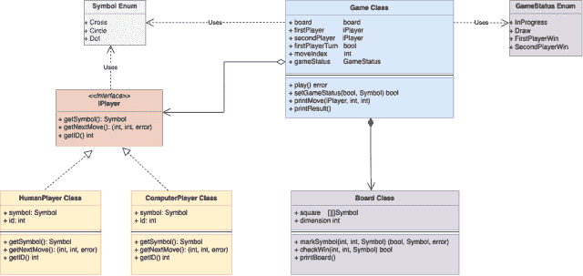

# 井字棋游戏的系统设计

> 原文：[`techbyexample.com/system-design-tic-tac-toe-game/`](https://techbyexample.com/system-design-tic-tac-toe-game/)

目录

+   概述

+   UML 图

+   低级设计

+   程序

+   完整工作代码：

+   结论

## **概述**

井字棋是一种棋盘游戏。首先让我们理解游戏规则。在本教程中，我们将

+   首先通过一个例子了解井字棋游戏

+   查看低级设计的 UML 图

+   然后我们将看到用 Go 语言表达的低级设计

+   最后，我们将看到一个具有适当设计的完整工作代码

首先通过一个例子了解井字棋游戏

+   这是一个 n*n 的棋盘，每个块只能标记为**十字**或**圆圈**，前提是该块为空。

+   两个玩家同时进行游戏，每个玩家轮流行动。

+   第一玩家在其回合时在棋盘上的任意一个空块上标记一个**十字**。而第二玩家在其回合时在棋盘上的任意一个空块上标记一个**圆圈**。

+   游戏的目标是让某一方在一整行、一整列或一条对角线上占满任意一个符号，**十字**或**圆圈**。

+   两个玩家将尽力阻止对方实现目标。谁先实现目标，谁就获胜。

+   如果棋盘上的所有块都已满，且没有任何玩家能够用其符号标记整行、整列或对角线，则游戏结果为平局。

+   一旦有一方获胜，游戏将不再允许任何移动。

让我们通过一个例子来理解这个游戏。假设是一个 3*3 的网格。点（‘.’）表示一个空白块。

```go
Player 1 Move with Symbol * at Position X:1 Y:1
...
.*.
...

Player 2 Move with Symbol o at Position X:1 Y:2
...
.*o
...

Player 1 Move with Symbol * at Position X:2 Y:0
...
.*o
*..

Player 2 Move with Symbol o at Position X:0 Y:2
..o
.*o
*..

Player 1 Move with Symbol * at Position X:2 Y:2
..o
.*o
*.*

Player 2 Move with Symbol o at Position X:0 Y:0
o.o
.*o
*.*

Player 1 Move with Symbol * at Position X:2 Y:1
o.o
.*o
***

First Player Win
o.o
.*o
***
```

在上面的游戏中，第一玩家获胜，因为第三行全部被**十字**符号‘*’占据。

## **UML 图**

让我们先看看同样的 UML 图。



以下是 UML 图中的一些思路

+   有一个符号枚举（Symbol Enum），表示棋盘上使用的不同符号。符号可以是**十字**、**圆圈**或**点**。**点**表示棋盘中的一个空白块。

+   有一个 iPlayer 接口，表示游戏中的玩家。

+   玩家可以是人类玩家或计算机玩家。因此，有一个**humanPlayer**类和一个**computerPlayer**类，它们实现了 iPlayer 接口。

+   有一个棋盘类，仅用于捕获棋盘的细节。根据棋盘的状态，它会告诉你是否有某一行、列或对角线已经被完成，并且是哪个符号。它与玩家或游戏本身无关。它知道如何打印棋盘。这个棋盘类将会被游戏类使用，正如我们接下来所见。

+   有一个游戏状态枚举类（Game Status Enum），定义了游戏的不同状态。游戏可以处于进行中（Inprogresss）、平局（Draw）、第一玩家胜（FirstPlayerWin）或第二玩家胜（SecondPlayerWin）状态。

+   有一个游戏类用于控制游戏的执行。它包含了棋盘对象，以及两个玩家对象作为其字段。除此之外，它还有其他字段，如 gameStatus（游戏状态）、moveIndex（步数索引）等。

## **低级设计**

让我们来看一下用 Go 编程语言表达的该问题的低级设计。

**iPlayer 接口**

```go
type iPlayer interface {
	getSymbol() Symbol
	getNextMove() (int, int, error)
	getID() int
}
```

**人类玩家类**

```go
type humanPlayer struct {
	symbol Symbol
}

func (h *humanPlayer) getSymbol() Symbol

func (h *humanPlayer) getNextMove() (int, int, error)

func (h *humanPlayer) getID() int
```

**计算机玩家类**

```go
type computerPlayer struct {
	symbol Symbol
	id     int
}

func (c *computerPlayer) getSymbol() Symbol 

func (c *computerPlayer) getNextMove() (int, int, error) 

func (c *computerPlayer) getID() int 
```

**符号枚举**

```go
type Symbol uint8

const (
	Cross Symbol = iota
	Circle
	Dot
)
```

**游戏状态枚举**

```go
type GameStatus uint8

const (
    GameInProgress GameStatus = iota
    GameDraw
    FirstPlayerWin
    SecondPlayerWin
)
```

**棋盘类**

```go
type board struct {
    square    [][]Symbol
    dimension int
}

func (b *board) markSymbol(i, j int, symbol Symbol) (bool, Symbol, error) 

func (b *board) checkWin(i, j int, symbol Symbol) bool 

func (b *board) printBoard()
```

**游戏类**

```go
type game struct {
    board           *board
    firstPlayer     iPlayer
    secondPlayer    iPlayer
    firstPlayerTurn bool
    moveIndex       int
    gameStatus      GameStatus
}

func initGame(b *board, p1, p2 iPlayer) *game 

func (g *game) play() error 

func (g *game) setGameStatus(win bool, symbol Symbol) 

func (g *game) printMove(player iPlayer, x, y int)

func (g *game) printResult() 
```

## **程序**

这是完整的工作代码。

**symbol.go**

```go
package main

type Symbol uint8

const (
    Cross Symbol = iota
    Circle
    Dot
)
```

**iPlayer.go**

```go
package main

type iPlayer interface {
    getSymbol() Symbol
    getNextMove() (int, int, error)
    getID() int
}
```

**humanPlayer.go**

```go
package main

import "fmt"

var (
	MovesPlayer1 = [4][2]int{{1, 1}, {2, 0}, {2, 2}, {2, 1}}
	MovesPlayer2 = [4][2]int{{1, 2}, {0, 2}, {0, 0}, {0, 0}}
)

type humanPlayer struct {
	symbol Symbol
	index  int
	id     int
}

func (h *humanPlayer) getSymbol() Symbol {
	return h.symbol
}

func (h *humanPlayer) getNextMove() (int, int, error) {
	if h.symbol == Cross {
		h.index = h.index + 1
		return MovesPlayer1[h.index-1][0], MovesPlayer1[h.index-1][1], nil
	} else if h.symbol == Circle {
		h.index = h.index + 1
		return MovesPlayer2[h.index-1][0], MovesPlayer2[h.index-1][1], nil
	}
	return 0, 0, fmt.Errorf("Invalid Symbol")
}

func (h *humanPlayer) getID() int {
	return h.id
}
```

**computerPlayer.go**

```go
package main

type computerPlayer struct {
	symbol Symbol
	id     int
}

func (c *computerPlayer) getSymbol() Symbol {
	return c.symbol
}

func (c *computerPlayer) getNextMove() (int, int, error) {
	//To be implemented
	return 0, 0, nil
}

func (c *computerPlayer) getID() int {
	return c.id
}
```

**gameStatus.go**

```go
package main

type GameStatus uint8

const (
	GameInProgress GameStatus = iota
	GameDraw
	FirstPlayerWin
	SecondPlayerWin
)
```

**board.go**

```go
package main

import "fmt"

type board struct {
	square    [][]Symbol
	dimension int
}

func (b *board) printBoard() {
	for i := 0; i < b.dimension; i++ {
		for j := 0; j < b.dimension; j++ {
			if b.square[i][j] == Dot {
				fmt.Print(".")
			} else if b.square[i][j] == Cross {
				fmt.Print("*")
			} else {
				fmt.Print("o")
			}

		}
		fmt.Println("")
	}
}

func (b *board) markSymbol(i, j int, symbol Symbol) (bool, Symbol, error) {
	if i > b.dimension || j > b.dimension {
		return false, Dot, fmt.Errorf("index input is greater than dimension")
	}
	if b.square[i][j] != Dot {
		return false, Dot, fmt.Errorf("input square already marked")
	}
	if symbol != Cross && symbol != Circle {
		return false, Dot, fmt.Errorf("incorrect Symbol")
	}
	b.square[i][j] = symbol
	win := b.checkWin(i, j, symbol)

	return win, symbol, nil
}

func (b *board) checkWin(i, j int, symbol Symbol) bool {
	//Check Row
	rowMatch := true
	for k := 0; k < b.dimension; k++ {
		if b.square[i][k] != symbol {
			rowMatch = false
		}
	}

	if rowMatch {
		return rowMatch
	}

	//Check Row
	columnMatch := true
	for k := 0; k < b.dimension; k++ {
		if b.square[k][j] != symbol {
			columnMatch = false
		}
	}

	if columnMatch {
		return columnMatch
	}

	//Check diagonal
	diagonalMatch := false
	if i == j {
		diagonalMatch = true
		for k := 0; k < b.dimension; k++ {
			if b.square[k][k] != symbol {
				diagonalMatch = false
			}
		}
	}

	return diagonalMatch

}
```

**game.go**

```go
package main

import "fmt"

type game struct {
    board           *board
    firstPlayer     iPlayer
    secondPlayer    iPlayer
    firstPlayerTurn bool
    moveIndex       int
    gameStatus      GameStatus
}

func initGame(b *board, p1, p2 iPlayer) *game {
    game := &game{
        board:           b,
        firstPlayer:     p1,
        secondPlayer:    p2,
        firstPlayerTurn: true,
        gameStatus:      GameInProgress,
    }
    return game
}

func (g *game) play() error {
    var win bool
    var symbol Symbol
    for {
        if g.firstPlayerTurn {
            x, y, err := g.firstPlayer.getNextMove()
            if err != nil {
                return err
            }
            win, symbol, err = g.board.markSymbol(x, y, g.firstPlayer.getSymbol())
            if err != nil {
                return err
            }
            g.firstPlayerTurn = false
            g.printMove(g.firstPlayer, x, y)
        } else {
            x, y, err := g.secondPlayer.getNextMove()
            if err != nil {
                return err
            }
            win, symbol, err = g.board.markSymbol(x, y, g.secondPlayer.getSymbol())
            if err != nil {
                return err
            }
            g.firstPlayerTurn = true
            g.printMove(g.secondPlayer, x, y)
        }
        g.moveIndex = g.moveIndex + 1
        g.setGameStatus(win, symbol)
        if g.gameStatus != GameInProgress {
            break
        }
    }
    return nil
}

func (g *game) setGameStatus(win bool, symbol Symbol) {
    if win {
        if g.firstPlayer.getSymbol() == symbol {
            g.gameStatus = FirstPlayerWin
            return
        } else if g.secondPlayer.getSymbol() == symbol {
            g.gameStatus = SecondPlayerWin
            return
        }
    }
    if g.moveIndex == g.board.dimension*g.board.dimension {
        g.gameStatus = GameDraw
        return
    }
    g.gameStatus = GameInProgress
}

func (g *game) printMove(player iPlayer, x, y int) {
	symbolString := ""
	symbol := player.getSymbol()
	if symbol == Cross {
		symbolString = "*"
	} else if symbol == Circle {
		symbolString = "o"
	}
	fmt.Printf("Player %d Move with Symbol %s at Position X:%d Y:%d\n", player.getID(), symbolString, x, y)
	g.board.printBoard()
	fmt.Println("")
}

func (g *game) printResult() {
    switch g.gameStatus {
    case GameInProgress:
        fmt.Println("Game in Between")
    case GameDraw:
        fmt.Println("Game Drawn")
    case FirstPlayerWin:
        fmt.Println("First Player Win")
    case SecondPlayerWin:
        fmt.Println("Second Player Win")
    default:
        fmt.Println("Invalid Game Status")
    }
    g.board.printBoard()
}
```

**输出**

在上面的程序中，我们已经在**humanPlayer.go**文件中固定了两个玩家的步伐。基于这些步伐，以下是输出结果。

```go
Player 1 Move with Symbol * at Position X:1 Y:1
...
.*.
...

Player 2 Move with Symbol o at Position X:1 Y:2
...
.*o
...

Player 1 Move with Symbol * at Position X:2 Y:0
...
.*o
*..

Player 2 Move with Symbol o at Position X:0 Y:2
..o
.*o
*..

Player 1 Move with Symbol * at Position X:2 Y:2
..o
.*o
*.*

Player 2 Move with Symbol o at Position X:0 Y:0
o.o
.*o
*.*

Player 1 Move with Symbol * at Position X:2 Y:1
o.o
.*o
***

First Player Win
o.o
.*o
***
```

## **完整工作代码：**

这是一个文件中的完整工作代码。

**main.go**

```go
package main

import "fmt"

type Symbol uint8

const (
	Cross Symbol = iota
	Circle
	Dot
)

type GameStatus uint8

const (
	GameInProgress GameStatus = iota
	GameDraw
	FirstPlayerWin
	SecondPlayerWin
)

type iPlayer interface {
	getSymbol() Symbol
	getNextMove() (int, int, error)
	getID() int
}

var (
	MovesPlayer1 = [4][2]int{{1, 1}, {2, 0}, {2, 2}, {2, 1}}
	MovesPlayer2 = [4][2]int{{1, 2}, {0, 2}, {0, 0}, {0, 0}}
)

type humanPlayer struct {
	symbol Symbol
	index  int
	id     int
}

func (h *humanPlayer) getSymbol() Symbol {
	return h.symbol
}

func (h *humanPlayer) getNextMove() (int, int, error) {
	if h.symbol == Cross {
		h.index = h.index + 1
		return MovesPlayer1[h.index-1][0], MovesPlayer1[h.index-1][1], nil
	} else if h.symbol == Circle {
		h.index = h.index + 1
		return MovesPlayer2[h.index-1][0], MovesPlayer2[h.index-1][1], nil
	}
	return 0, 0, fmt.Errorf("Invalid Symbol")
}

func (h *humanPlayer) getID() int {
	return h.id
}

type computerPlayer struct {
	symbol Symbol
	id     int
}

func (c *computerPlayer) getSymbol() Symbol {
	return c.symbol
}

func (c *computerPlayer) getNextMove() (int, int, error) {
	//To be implemented
	return 0, 0, nil
}

func (c *computerPlayer) getID() int {
	return c.id
}

type board struct {
	square    [][]Symbol
	dimension int
}

func (b *board) printBoard() {
	for i := 0; i < b.dimension; i++ {
		for j := 0; j < b.dimension; j++ {
			if b.square[i][j] == Dot {
				fmt.Print(".")
			} else if b.square[i][j] == Cross {
				fmt.Print("*")
			} else {
				fmt.Print("o")
			}

		}
		fmt.Println("")
	}
}

func (b *board) markSymbol(i, j int, symbol Symbol) (bool, Symbol, error) {
	if i > b.dimension || j > b.dimension {
		return false, Dot, fmt.Errorf("index input is greater than dimension")
	}
	if b.square[i][j] != Dot {
		return false, Dot, fmt.Errorf("input square already marked")
	}
	if symbol != Cross && symbol != Circle {
		return false, Dot, fmt.Errorf("incorrect Symbol")
	}
	b.square[i][j] = symbol
	win := b.checkWin(i, j, symbol)

	return win, symbol, nil
}

func (b *board) checkWin(i, j int, symbol Symbol) bool {
	//Check Row
	rowMatch := true
	for k := 0; k < b.dimension; k++ {
		if b.square[i][k] != symbol {
			rowMatch = false
		}
	}

	if rowMatch {
		return rowMatch
	}

	//Check Row
	columnMatch := true
	for k := 0; k < b.dimension; k++ {
		if b.square[k][j] != symbol {
			columnMatch = false
		}
	}

	if columnMatch {
		return columnMatch
	}

	//Check diagonal
	diagonalMatch := false
	if i == j {
		diagonalMatch = true
		for k := 0; k < b.dimension; k++ {
			if b.square[k][k] != symbol {
				diagonalMatch = false
			}
		}
	}

	return diagonalMatch

}

type game struct {
	board           *board
	firstPlayer     iPlayer
	secondPlayer    iPlayer
	firstPlayerTurn bool
	moveIndex       int
	gameStatus      GameStatus
}

func initGame(b *board, p1, p2 iPlayer) *game {
	game := &game{
		board:           b,
		firstPlayer:     p1,
		secondPlayer:    p2,
		firstPlayerTurn: true,
		gameStatus:      GameInProgress,
	}
	return game
}

func (g *game) play() error {
	var win bool
	var symbol Symbol
	for {
		if g.firstPlayerTurn {
			x, y, err := g.firstPlayer.getNextMove()
			if err != nil {
				return err
			}
			win, symbol, err = g.board.markSymbol(x, y, g.firstPlayer.getSymbol())
			if err != nil {
				return err
			}
			g.firstPlayerTurn = false
			g.printMove(g.firstPlayer, x, y)
		} else {
			x, y, err := g.secondPlayer.getNextMove()
			if err != nil {
				return err
			}
			win, symbol, err = g.board.markSymbol(x, y, g.secondPlayer.getSymbol())
			if err != nil {
				return err
			}
			g.firstPlayerTurn = true
			g.printMove(g.secondPlayer, x, y)
		}
		g.moveIndex = g.moveIndex + 1

		g.setGameStatus(win, symbol)
		if g.gameStatus != GameInProgress {
			break
		}
	}
	return nil
}

func (g *game) setGameStatus(win bool, symbol Symbol) {
	if win {
		if g.firstPlayer.getSymbol() == symbol {
			g.gameStatus = FirstPlayerWin
			return
		} else if g.secondPlayer.getSymbol() == symbol {
			g.gameStatus = SecondPlayerWin
			return
		}
	}
	if g.moveIndex == g.board.dimension*g.board.dimension {
		g.gameStatus = GameDraw
		return
	}
	g.gameStatus = GameInProgress
}

func (g *game) printMove(player iPlayer, x, y int) {
	symbolString := ""
	symbol := player.getSymbol()
	if symbol == Cross {
		symbolString = "*"
	} else if symbol == Circle {
		symbolString = "o"
	}
	fmt.Printf("Player %d Move with Symbol %s at Position X:%d Y:%d\n", player.getID(), symbolString, x, y)
	g.board.printBoard()
	fmt.Println("")
}

func (g *game) printResult() {
	switch g.gameStatus {
	case GameInProgress:
		fmt.Println("Game in Between")
	case GameDraw:
		fmt.Println("Game Drawn")
	case FirstPlayerWin:
		fmt.Println("First Player Win")
	case SecondPlayerWin:
		fmt.Println("Second Player Win")
	default:
		fmt.Println("Invalid Game Status")
	}
	g.board.printBoard()
}

func main() {

	board := &board{
		square:    [][]Symbol{{Dot, Dot, Dot}, {Dot, Dot, Dot}, {Dot, Dot, Dot}},
		dimension: 3,
	}

	player1 := &humanPlayer{
		symbol: Cross,
		id:     1,
	}

	player2 := &humanPlayer{
		symbol: Circle,
		id:     2,
	}

	game := initGame(board, player1, player2)
	game.play()
	game.printResult()

}
```

**输出**

在上述程序中，我们同样在**humanPlayer 类**中固定了两个玩家的步伐。基于这些步伐，以下是输出结果。

```go
Player 1 Move with Symbol * at Position X:1 Y:1
...
.*.
...

Player 2 Move with Symbol o at Position X:1 Y:2
...
.*o
...

Player 1 Move with Symbol * at Position X:2 Y:0
...
.*o
*..

Player 2 Move with Symbol o at Position X:0 Y:2
..o
.*o
*..

Player 1 Move with Symbol * at Position X:2 Y:2
..o
.*o
*.*

Player 2 Move with Symbol o at Position X:0 Y:0
o.o
.*o
*.*

Player 1 Move with Symbol * at Position X:2 Y:1
o.o
.*o
***

First Player Win
o.o
.*o
***
```

## **结论**

这就是关于设计井字棋游戏的内容。希望你喜欢这个教程。请在评论中提供你的反馈。
