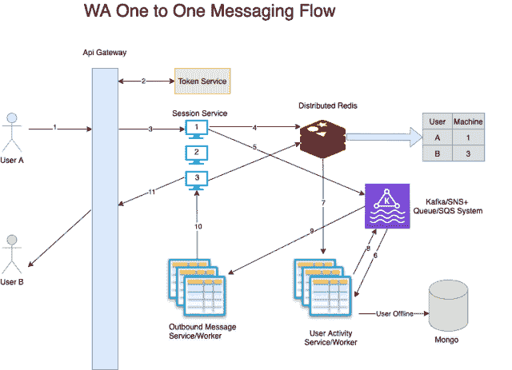
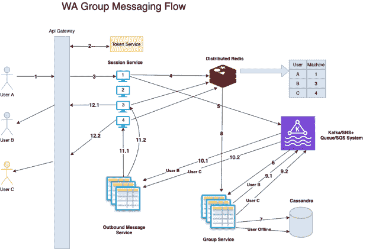
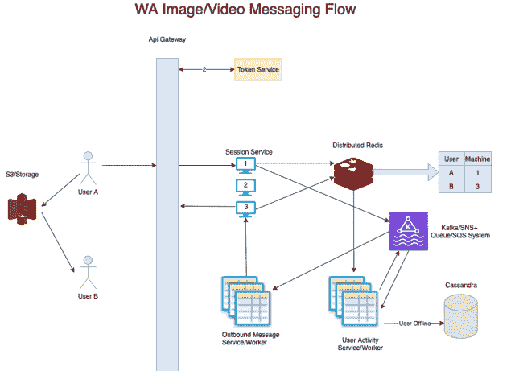

# Whatsapp 系统设计

> 原文：[`techbyexample.com/whatsapp-system-design/`](https://techbyexample.com/whatsapp-system-design/)

目录

+   概述

+   Whatsapp 无法通过 HTTP 协议工作

+   在 Whatsapp 中，一致性比可用性更重要

+   一对一消息

    +   高级设计

    +   让我们看看需要哪些 API

    +   让我们看看每个功能是如何工作的

    +   已读回执将如何工作

    +   如果用户 B 处于离线状态怎么办

    +   如何确保在用户 B 端消息的顺序

    +   如果连接用户的机器之一发生故障怎么办

    +   竞态条件怎么办

    +   如果用户 A 处于离线状态怎么办

+   在线状态和最后一次见面将如何工作

+   群组消息

+   上传图片或视频

+   其他常见组件

+   非功能性需求

    +   可扩展性

    +   低延迟

    +   警报和监控

    +   向用户位置靠近

    +   避免单点故障

+   结论

## **概述**

在回答任何系统设计问题时，重要的是要记住系统设计问题可能非常宽泛。因此，切勿直接跳到解决方案。与面试官讨论使用场景是非常有益的，这样可以理解他在寻找什么。决定你将包括在系统设计中的一组功能。

这也是面试官所关注的方面之一。他们可能在寻找

+   你是如何进行需求分析的

+   你是否能够列出所有需求

+   你在问什么问题。

同时，在进行系统设计时，逐步进行设计非常重要。你需要先列出系统设计将支持的所有功能。首先讨论第一个功能的设计，然后再扩展其他功能的设计。

## **Whatsapp 无法通过 HTTP 协议工作。**

设计 WhatsApp 时需要记住的一点是，它为每个用户保持连接。因此，需要注意的要点是，每个用户都会保持一个持久的连接，这个持久连接与服务器之间保持。 

如果你考虑 WhatsApp，显然它不能通过 HTTP 协议工作。

这是因为 HTTP 是一个客户端到服务器的协议。它是一种请求-响应架构，客户端发送请求，服务器发送响应。由于它是客户端到服务器的协议，因此服务器无法与客户端通信。此外，持久连接也没有保持。

因此，Whatsapp 需要通过 TCP 协议进行通信，这是点对点通信。以下是一些选项。

+   **HTTP 长轮询** – 在这种方式中，客户端在向服务器发送请求后会等待一段时间。涉及长轮询。然后，客户端可以在特定时间后重新发起请求。

+   **Web sockets** – 这是一种完全双向连接，客户端可以与服务器通信，服务器也可以与客户端通信。在这种方式下，服务器或客户端可以随时发送/接收数据，连接始终保持开放。

总的来说，Web sockets 最适合我们的场景。Web sockets 的另一个优点是它们具有粘性会话，如果特定用户需要连接到特定服务器并连接到服务器端的某个实例，那么它将始终与该实例保持连接。该用户的所有请求都将只发送到那个特定实例。因此，这使得 Web sockets 成为点对点通信的一个很好的选择。

在进行任何服务的系统设计时，另一个需要考虑的点是不要立即跳到解决方案上。因为应用程序可能具有很多功能，最好先明确你将要在系统设计中包含哪些功能。这一点非常重要，必须进行讨论。另一个需要记住的重要事项是要考虑非功能性需求。一些非功能性需求可能包括：

+   单点故障

+   可扩展性 – 扩展到数百万的用户

+   可用性

+   低延迟或性能

+   容错性

+   存储估算

+   成本估算

我们将在系统设计中针对以下功能进行设计。

+   一对一消息

+   群组消息

+   已读回执 / 在线状态

+   消息存储

+   图片/视频消息

## **在 WhatsApp 中，一致性比可用性更为重要。**

对于 Whatsapp 来说，可用性是一个重要因素，但一致性更为重要。基本上，比可用性更重要的是确保消息能够按顺序传送并被所有用户接收。

## **一对一消息传递**

对于一对一消息传递，让我们来看一下所需的高层次设计。

### **高层设计**

从高层次来讨论，我们来看看整体流程是什么样的，存在哪些服务。

+   将会有一个**API 网关**，所有用户的请求都会通过它。

+   将会有一个**会话服务**。**会话服务**将包含一组实例，用户将通过 WebSocket 连接到这些实例。由于每台机器上可打开的 WebSocket 数量有限，具体数量取决于负载。因此，根据用户数量，我们可以配置相应数量的机器。

+   这个**会话服务**将连接到一个**分布式 Redis**集群，该集群将包含关于哪个用户连接到哪个机器的信息。这些信息是暂时的，直到用户断开连接，因此我们可以使用**分布式 Redis**来存储。会话服务将负责维护用户 ID 和机器 ID 的映射关系。这个服务将会

    +   如果有用户连接到某台机器，将会插入数据。

    +   当用户断开连接时。

+   除此之外，会话服务将是一个简单的服务，意味着它只会接受连接，并将任何请求转发到一个**SNS/Kafka**主题。

+   **会话服务**将在接收到任何用户活动时，发布消息到一个 SNS 主题或 Kafka。

+   将会有一个**用户活动服务**，它是一个工作服务，监听这个 SNS/Kafka 主题。接收到消息后，它将与分布式 Redis 交互，识别接收方连接的用户。这项服务还将处理用户离线的情况。一旦获取所有信息，它将把消息发送到另一个服务，那个服务也是一个工作服务。这个服务将是**消息外发服务**。

+   将会有一个**消息外发服务**，这是一个工作服务，它的工作是将外发消息发送回用户。此服务不包含任何业务逻辑。它只会接受一个包含发送消息的详细信息的消息，这些信息包括消息内容、接收人以及用户连接的机器。这是一个非常简单的服务，完全不包含任何业务逻辑。

+   我们需要一个数据库来存储消息，如果接收方用户离线。我们可以使用**Mongo DB**来实现。

### **让我们看看需要哪些 API**

+   发送文本消息

+   获取所有未读消息（当用户在离线一段时间后重新上线时）。

**Mongo DB**将有一个表来存储消息。我们可以把这个表命名为**消息表**。

**消息表**

消息表中将包含以下字段。

+   **消息 ID**

+   **发送方用户 ID**

+   **接收方用户 ID**

+   **类型** – 可能是**文本**、**图片**或**视频**

+   **body** – 实际的消息内容。

+   **created**

+   **updated**

+   **is_received**

+   **is_group** – 这条消息是否为群组消息。

+   **group_id** – 仅在消息为群组消息时设置。

### **让我们看看每个功能如何工作**

用户 A 将通过 WebSocket 连接到会话服务的某一台机器。假设它连接到机器 2。会在分布式 Redis 中创建一条用户 A 到机器 1 的映射。同样，假设用户 B 连接到机器 3，也会在 Redis 中创建用户 B 到机器 3 的映射。

+   用户 A 将向用户 B 发送一条消息。消息会传送到机器 1 上的会话服务，然后被发送到 **Kafka/SNS** 主题。

+   用户活动服务/工作者将监听这条消息。

+   它将检查分布式 Redis 以确认用户 B 连接到哪台机器。然后，它会再次向不同的 Kafka/SNS 主题发布两条消息。一条消息是发送给用户 B 的交付消息，另一条消息是向用户 A 确认消息已经发送。这些消息将被 **消息出站服务** 监听。

+   **消息出站服务** 将获取这两条消息并处理它们。这个服务是一个傻瓜服务，只知道将消息转发到正确的机器，从而确保消息能够送达用户。它只与 **会话服务** 通信，其他的什么也不做。

下面是相应的架构图。该图表示了用户 A 向用户 B 发送消息的流程。

让我们来理解上述图示。

**用户 A 的流程**

1.  用户 A 调用 API 网关。

1.  用户身份验证通过令牌服务进行。

1.  用户 A 连接到第 1 号机器。

1.  会在 Redis 中创建用户 ID 到机器 ID 的映射。

1.  发送给用户 B 的消息会发布到该主题上。

1.  它被用户活动服务/工作者提取。

1.  它将从 Redis 中查询，了解用户 B 当前连接的机器。如果用户 B 离线，MongoDB 将发挥作用。我们稍后会讨论这个问题。

1.  在确认用户 B 连接的机器后，它会将消息发布到用于出站消息服务/工作者的主题。

1.  出站消息服务/工作者从主题中获取这条消息。该消息包含要发送的消息内容、接收方和用户当前连接的机器。这个服务非常简单，根本没有任何业务逻辑。

1.  它会在与用户 B 连接的机器 3 上发起 API 调用。

1.  消息通过 WebSocket 发送到用户 B。

**用户 B 的流程**

+   用户 B 调用 API 网关。

+   用户身份验证通过令牌服务进行。

+   用户 B 连接到第 3 号机器。

还有一些未解答的问题需要解决。

+   阅读回执将如何工作。

+   如果用户 B 离线怎么办？

+   **如何确保在用户 B 端消息的顺序**。这意味着，如果用户 A 发送了两条消息 M1 和 M2，且顺序为 M1 后 M2，那么用户 B 也应该按相同的顺序接收这些消息，即用户 B 应该先看到 M1，然后是 M2。

+   如果用户连接的某台机器发生故障怎么办

+   那么竞争条件（race condition）该如何处理呢？我们也将讨论一个竞争条件的例子。

+   如果用户 A 离线怎么办

让我们逐一讨论这些点

### **如何处理已读回执**

一旦用户 B 接收到消息，确认消息将再次发送给机器 3，然后到用户活动服务，再到消息外发服务，最后发送回机器 1，传递给用户 A。当用户 B 读取消息时，也会发生相同的流程。这就是已读回执的工作方式。

### **如果用户 B 离线怎么办**

如果用户离线，WhatsApp 会将消息存储最长达 30 天。因此，在这种情况下，WhatsApp 会将消息存储在其数据库中，数据库是 Mongo DB。所以当用户上线并且首次建立连接时，以下是流程。

+   假设用户 B 将连接到机器 7。系统会在分布式 Redis 中创建一条记录。然后，它会在一个主题上发布消息。

+   用户活动服务将获取这条消息。接着，它会检查数据库中是否存在用户 B 的所有消息。

+   系统会将这些消息发送给用户外发服务，然后通过机器 7 发送给用户 B。

+   一旦用户 B 收到所有这些消息，系统将向所有发送者发送确认消息，表示该消息已被接收。我们上面讨论的相同流程将会继续。

+   一旦用户 B 读取了所有这些消息，系统将向所有发送者发送确认消息，表示该消息已被读取。在发送完确认消息后，消息将从数据库中删除，可能通过另一个服务，即 **清理服务**。

### **如何确保在用户 B 端消息的顺序**

在服务器端，每条消息的处理是无状态的，这意味着每条消息都独立处理，不受其他消息的影响。以下是一种可以用来确保消息顺序的方法。

+   每条消息都会有一个父消息 ID。父消息 ID 是指在消息顺序中，当前消息前一条消息的 ID。WA 客户端将使用 UUID 来生成这个消息 ID。

+   每条消息都会被发送到 WA 客户端。由 WA 客户端负责展示有序的消息。例如，假设有三条消息。

    +   M1 的父消息 ID 为 null，假设这是第一次发送的消息。

    +   M2 的父消息 ID 是 M1 的

    +   M3 的父消息 ID 是 M2 的

+   这三条消息将以无状态的方式逐个处理，并返回到 WA 客户端。如果 WA 客户端收到某条消息，但没有收到当前消息的父消息 ID 对应的消息，它会等待该消息到达，而不是直接显示。例如，假设 WA 客户端收到 M1 和 M3 消息，但没有收到 M2 消息。那么它只会向用户显示 M1，并等待 M2 到达。它怎么知道需要等待 M2 呢？因为 M3 的父消息 ID 是 M2 的，它知道有一条消息丢失了。

+   如果 M2 消息没有在规定时间内到达怎么办？在这种情况下，用户 B 的 WA 客户端可以要求用户 A 重新发送这条消息。

这是确保消息顺序的一种思路。

### **如果用户连接的某台机器宕机怎么办**

假设某个实例终止了，而用户恰好连接到这个实例。可能是因为自动扩缩容，也可能是因为维护活动。在这种情况下，用户将重新建立连接，并且可能会连接到另一台机器。一旦连接建立，Redis 条目将会更新，反映新的机器 ID。

可能会有几条本应发送给该用户的消息在传输过程中失败。但由于每个地方都有重试机制，并且会带有一些延迟和抖动，因此当用户上线时，所有的消息都会通过新的连接正确发送。

### **那如果出现竞态条件怎么办**

例如，用户 A 向用户 B 发送了一条消息。当时用户 B 处于离线状态，消息被保存在数据库中。但在消息保存之前，用户 B 上线并从数据库中获取了所有待处理消息。但它无法获取到用户 A 的最新消息。

为了防止这种情况，客户端可以定期从数据库中获取所有处于未送达状态的消息。

### **如果用户 A 处于离线状态怎么办**

如果用户 A 处于离线状态，那么 Whatsapp 客户端会在用户 A 上线之前将消息存储起来。

## **在线状态和最后一次见面如何运作**

为此，新的服务端将维护一个额外的表格，我们可以称之为**user_last_seen**服务端。该表格中的字段如下：

+   user_id

+   last_seen

我们来看一下这个表格如何更新。假设有两个用户 A 和 B。

**对于用户 A**

+   这个表格会在用户 A 进行任何用户活动时更新，任何由用户发起的活动都会被视为用户活动。如果用户进行活动，系统会将信息发送到会话服务，并在 SNS/Kafka 主题上发布一条消息。**user_last_seen**服务端也会通过队列订阅这个主题。对于每个用户活动，它会更新表格中的最后一次见面字段。

+   也可能出现用户刚在线但没有进行任何活动的情况。在这种情况下，会发送一个心跳消息，并更新该表格。

+   请注意，这张表格不会因非用户活动而更新。例如，当用户的 WhatsApp 未打开并正在获取消息时，这就是一种非用户活动。

**对于用户 B**

+   用户 B 想要获取用户 A 的在线状态。它会发送请求。请求会到达 **user_last_seen** 服务。

+   我们可以设置一个阈值。如果用户的 **last_seen** 字段距离现在不到 2 秒，它将把状态发送为在线，用户 B 将看到用户 A 在线。

+   如果最后一次查看字段距离现在超过 2 秒，则会将状态发送为离线（false），并返回最后查看的时间戳。这个时间戳将显示给用户 B。

## **群组消息**

让我们来看看群组消息是如何工作的。我们可以使用一个群组服务，它将作为一个工作节点。它将有以下数据库。

**群组表**

它将包含以下字段

+   group_id

+   group_title

+   创建

+   更新

+   group_image_id

**GroupId-UserId 映射**

它将包含以下字段

+   group_id

+   user_id

+   is_admin

一个重要的要点是，这个 **GroupId-UserId** 会根据 groupId 分片，这样当获取属于特定 groupId 的所有用户 ID 时，调用只会发送到某个分片。

我们将提供以下 API

+   群组创建

+   群组成员添加

+   群组成员删除

+   群组成员管理员

+   群组成员移除

+   群组标题更新

+   群组图片更新

+   群组消息发送

让我们来看看群组消息是如何发送的。

+   一个群组有四个用户：A、B、C 和 D

+   用户 A 想要向整个群组发送消息

+   它调用发送群组消息的功能，并同时发送群组 ID 和消息。消息到达用户所连接的机器，并由机器将消息发布到一个主题。

+   它由群组服务选择。该服务从群组表中获取所有群组成员。对于每个群组成员，它将消息重新分发到不同的主题。

+   所有这些消息再次被群组服务或工作节点选择。每条消息都被处理并发送给每个群组成员。

+   当任何群组成员接收到消息时，会向消息发送者发送一条确认回执。

+   如果任何群组成员阅读了消息，则会再次向消息发送者发送确认回执。

请注意，如果任何群组成员处于离线状态，则会在 MongoDB 的消息表中为该成员创建一个条目。因此，我们在消息表中有 **group_id** 和 **is_group** 字段。

以下是相应的架构图。该图表示从用户 A 到用户 B 和用户 C 发送消息的流程，他们属于同一个 WhatsApp 群组。

让我们理解上面的图示。

**用户 A 的流程**

1.  用户 A 向 API 网关发起调用。

1.  用户认证通过 Token 服务进行

1.  用户 A 连接到编号为 1 的盒子

1.  会在 Redis 中为 userId-machineID 映射创建一条条目。

1.  发送给群组的消息会发布到该主题。

1.  它由小组服务/工作者接收

1.  它从 Mongo 数据库中获取小组的所有其他成员

1.  对于每个成员，它会检查 Redis，以了解每个成员的连接情况。如果任何成员离线，则会通过 Mongo 数据库获取信息。

1.  它将消息分发给小组中每个其他成员。9.1 – 它将消息发送给用户 B。9.2 – 它将消息发送给用户 C

1.  两条消息都由外发消息服务/工作者接收。消息包含了发送的消息内容、发送对象以及用户连接的机器信息。

1.  它会在连接到用户 B 的机器 3 上进行 API 调用（11.1），并在连接到用户 C 的机器 4 上进行 API 调用**（11.2）**

1.  消息随后通过 WebSockets 发送给用户 B 和用户 C。

**用户 B 的流程**

+   用户 B 发起对 API 网关的调用

+   用户认证通过令牌服务进行。

+   用户 B 已连接到编号为 3 的盒子

**用户 C 的流程**

+   用户 C 发起对 API 网关的调用

+   用户认证通过令牌服务进行

+   用户 C 已连接到编号为 4 的盒子

## **上传图片或视频**

让我们来看一下图片和视频上传的工作流程。对于图片和视频上传，我们可以假设上传的不会是图片或视频的原始大小。客户端端会创建其低分辨率版本，然后进行上传。即使是任何图片和视频的低分辨率版本也只有几 KB。它们可以直接上传到存储提供商。例如，假设存储提供商是 AWS S3，那么以下是流程：

+   假设用户 A 在其 WA 客户端上希望发送一个请求，要求上传一张图片。客户端将向服务器发送请求，请求获取预签名的 URL，客户端可以通过该 URL 上传图片。

+   服务器将响应一个预签名的 URL，其有效期可能为几小时。您可以阅读这篇文章了解预签名 URL 的概念：[`docs.aws.amazon.com/AmazonS3/latest/userguide/ShareObjectPreSignedURL.html`](https://docs.aws.amazon.com/AmazonS3/latest/userguide/ShareObjectPreSignedURL.html)。基本上，这是一个已经通过令牌签名的 URL，因此可以直接上传到该 URL，无需进一步认证。这也被称为直接上传。服务器还会返回图像 ID。

+   客户端将图片上传到该 URL。图片将直接存储在 S3 中。

+   现在客户端将请求向接收者发送图片/视频上传消息。请求中还将传递图像 ID。

+   服务器将通过我们上面讨论的单对单消息流程，将消息发送给用户 B。

假设有多个用户同时上传相同的图片，这种情况可能会发生，例如某个特定的梗图变得流行。它将被多个用户发送。如果每次发送时都存储该图片的每个实例，将会浪费存储空间。这里有优化的空间。

我们可以做的是在客户端计算图像的摘要或哈希值。这个哈希值或摘要将被发送到服务器，服务器将检查该摘要或哈希值是否已存在。如果存在，服务器将直接返回该图像的 ID，而不返回预签名 URL。这样客户端就会知道图像已经存在，而不会再次上传图像。它只需使用图像 ID 来发送消息。

让我们看看这个方案的图示。正如图示所示，用户 A 和用户 B 使用直接上传和直接下载与 S3 或其他存储层进行数据传输，不通过 API 网关，从而避免了图像/视频传输过程中大量数据的高成本。

## **其他常见组件**

其他常见组件可能包括：

+   用户服务 – 存储用户个人资料信息。

+   Token/认证服务 – 用户令牌管理

+   短信服务 – 用于向用户发送任何类型的消息。例如：一次性密码（OTP）

+   分析服务 – 用于跟踪任何类型的分析数据。

## **非功能性需求**

我们已经讨论了所有功能需求的系统设计。现在，让我们讨论一些非功能性需求。

+   可扩展性

+   可用性

+   低延迟

+   向用户位置靠近。

+   避免单点故障。

### **可扩展性**

上述设计中需要考虑的第一点是可扩展性因素。系统中每个组件的可扩展性非常重要。以下是可能遇到的可扩展性挑战及其可能的解决方案：

+   会话服务中的每台机器只能承载有限数量的连接。因此，根据当前在线用户数量，可以设置机器和实例的数量。例如，一台机器有大约 65000 个端口。

+   你的 Kafka 系统可能无法承受如此大的负载。我们可以进行水平扩展，但有其限制。如果这成为瓶颈，那么根据地理位置或用户 ID，我们可以拥有两个或更多这样的系统。可以使用服务发现来确定请求需要访问哪个 Kafka 系统。

+   对其他服务也可以采用类似的方式。

+   可扩展性的另一个重要因素是，我们已经设计了系统，使得没有任何服务被过多的任务所压垮。服务之间有明确的职责分离，且我们在服务职责过重时进行了拆分。

### **低延迟**

消息可以从客户端以批次的形式发送，这样可能减少往返时间。**可用性**为了使系统具有高度可用性，几乎所有组件都需要具备冗余/备份。以下是一些需要完成的事项。

+   对于我们的数据库，我们需要启用复制。每个主分片节点应该有多个从节点。

+   对于分布式 Redis 集群，我们还需要复制。

+   为了实现数据冗余，我们也可以采取多区域架构。如果其中一个区域出现故障，这可能是其中一个好处。

+   还可以设置灾难恢复

### **警报和监控**

警报和监控也是非常重要的非功能性需求。我们应该监控每一个服务，并设置适当的警报。可以监控的一些内容包括：

+   API 响应时间

+   内存消耗

+   CPU 消耗

+   磁盘空间消耗

+   队列长度

+   ….

### **靠近用户位置**

这里有几种架构可以选择。其中一种是单元架构（Cell Architecture）。你可以在这里了解更多关于单元架构的内容 – [`github.com/wso2/reference-architecture/blob/master/reference-architecture-cell-based.md`](https://github.com/wso2/reference-architecture/blob/master/reference-architecture-cell-based.md)

### **避免单点故障**

单点故障是指系统中的某个部分，如果停止工作，可能导致整个系统崩溃。我们应该在设计中尽量避免任何单点故障。通过冗余和多区域部署，我们可以防止此类问题。

## **结论**

以上就是关于 WhatsApp 系统设计的内容。希望你喜欢这篇文章。请在评论中分享反馈。

+   [设计](https://techbyexample.com/tag/design/)*   [系统](https://techbyexample.com/tag/system/)*   [whatsapp](https://techbyexample.com/tag/whatsapp/)
