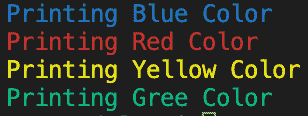

# 在 Ruby 语言中打印/输出颜色到控制台

> 原文：[`techbyexample.com/print-color-console-terminal-ruby/`](https://techbyexample.com/print-color-console-terminal-ruby/)

# **概述**

我们可以使用 colorize gem 来实现相同的功能

[`github.com/fazibear/colorize`](https://github.com/fazibear/colorize)

只需安装 Gem

```go
gem install colorize
```

# **程序**

```go
require 'colorize'

puts "Printing Blue Color".colorize(:blue)
puts "Printing Red Color".colorize(:red)
puts "Printing Yellow Color".colorize(:yellow)
puts "Printing Gree Color".colorize(:green)
```

**输出**



你也可以通过运行下面的代码来检查所有的颜色选项

```go
puts String.colors 
```

它将输出

```go
black
light_black
red
light_red
green
light_green
yellow
light_yellow
blue
light_blue
magenta
light_magenta
cyan
light_cyan
white
light_white
default
```
