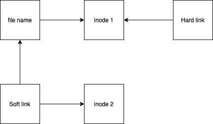

# Linux 中软链接和硬链接的区别是什么？

> 原文：[`techbyexample.com/difference-soft-links-and-hard-links/`](https://techbyexample.com/difference-soft-links-and-hard-links/)

在探讨区别之前，我们应该先简要了解一下“什么是 inode”。

**什么是 inode：**

**inode（索引节点）**是**基于 Unix 的文件系统**中的数据结构，用于存储文件的元数据，以及文件数据如何存储的位置。这包括与**文件大小、权限、组、所有权、文件类型、文件大小、链接数**等相关的信息。请记住！！inode 并不存储文件名。文件名信息始终存储在目录中，并与其相应的 inode 编号一起保存。

## **软链接：**

软链接也被称为符号链接，它是 Windows 上快捷方式的等效物。如果删除原始文件，符号链接将无法工作。每个符号链接都有不同的 inode。

## **硬链接：**

它是文件的另一个别名，不同于快捷方式。如果删除原始文件，硬链接仍然可以工作。

**让我们通过示例和图示来理解区别**。

```go
testuser-mbp:~ testuser$ touch test.txt
testuser-mbp:~ testuser$ ls -li test.txt 
12935258084 -rw-r--r--  1 testuser  staff  0 Sep  5 20:13 test.txt          #inode of the file "test.txt" is 12935258084   
testuser-mbp:~ testuser$ ln -s test.txt soft_link  #Let's create a soft link.
testuser-mbp:~ testuser$ ls -li soft_link   #Let's check inode number of the soft_link.
12935259053 lrwxr-xr-x  1 testuser  staff  8 Sep  5 20:16 soft_link -> test.txt   #inode of the soft_link is different from the file "test.txt" i.e. 12935259053
testuser-mbp:~ testuser$ ln test.txt hard_link   #Let's create a hard link now.
testuser-mbp:~ testuser$ ls -li hard_link   #Let's check inode number of the hard_link.
12935258084 -rw-r--r--  2 testuser  staff  0 Sep  5 20:13 hard_link       #inode of the hard_link is the same as of the file "test.txt" i.e.  12935258084 
```

## **图示：**



## **总结区别：**

| 软链接 | 硬链接 |
| --- | --- |
| 它有一个与原始文件不同的 inode。 | 它指向原始文件的 inode。 |
| 可以在文件和目录上创建。 | 只能在文件上创建，不能在目录上创建。 |
| 它相当于 Windows 上的快捷方式。 | 它相当于原始文件的另一个副本，指向文件的相同 inode。 |
| **命令** *ln -s 文件名 软链接名* | **命令**： *ln 文件名 硬链接名* |
| 可以跨不同文件系统使用。 | 不能跨不同文件系统使用。原因是一个文件系统的 inode 不能在不同的文件系统间共享，因为它们的结构不同。 |
| 如果删除原始文件，软链接将无法工作。 | 如果删除原始文件，硬链接仍然可以工作。 |
| 软链接支持绝对路径和相对路径。 | 硬链接仅支持绝对路径。 |
| 软链接的任何更改不会影响原始文件。 | 硬链接的任何更改会影响原始文件。 |
| 它需要额外的空间。 | 它不需要额外的空间。 |

+   [硬](https://techbyexample.com/tag/hard/)*   [链接](https://techbyexample.com/tag/link/)*   [软](https://techbyexample.com/tag/soft/)
